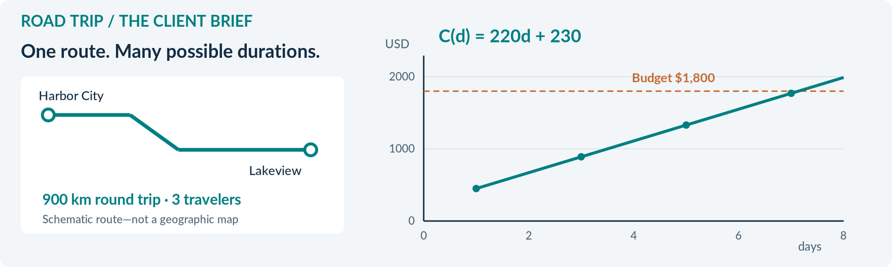
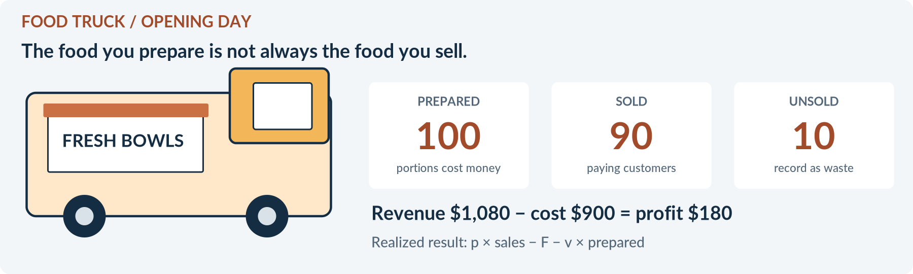
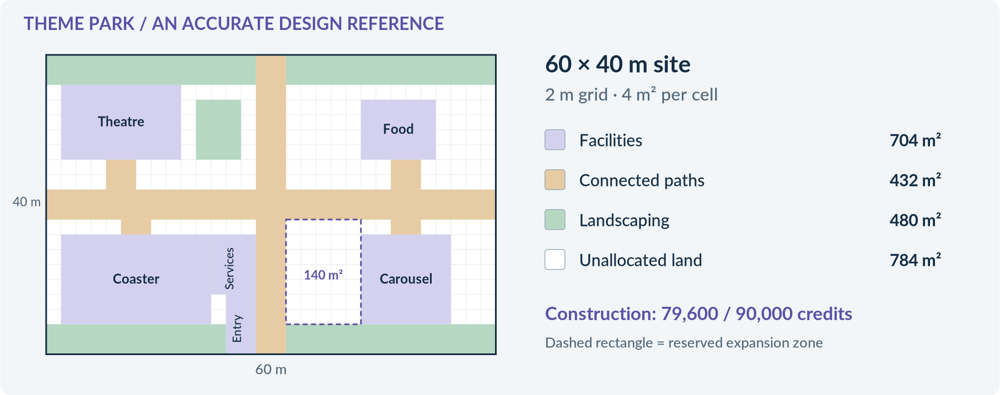
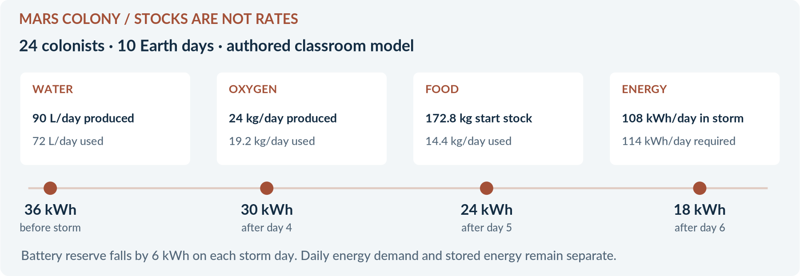
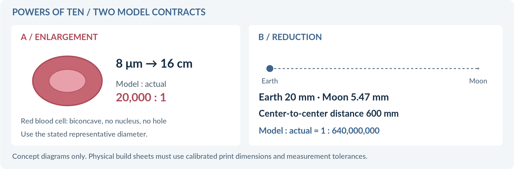

<!-- PAGE: COVER -->
# APPLIED MATHEMATICS
# PROJECT SERIES
## Curriculum · Experience · Implementation Dossier


**VERSION 1.0.0 | 15 SEPTEMBER 2026**

**Five bespoke projects. Five complete experiences. One self-contained HTML file per project.**

Road Trip Planner / Food Truck / Theme Park Designer / Mars Colony / Powers of Ten

**A WILLIAM MCADA PRODUCT**

Designed and built by William McAda · © 2026 William McAda

**Prepared for sequential implementation by Astra**

This dossier is the proposed build baseline, not a claim that the applications already exist. It defines the curriculum, interaction contracts, visual direction, data, mathematics, endings, export behavior, and release tests needed to build each project independently.

**Product boundary:** A coherent family of handcrafted classroom projects—not a generator, authoring platform, cartridge engine, live multiplayer system, or replacement for TestForge.

<!-- PAGE: 01 -->
# 01 / How to use this dossier

## The handoff contract
Read the common requirements first, then the complete chapter for the project being built. Implement one project end to end before starting the next. Common helpers may be copied into a project; the finished application must not depend on a shared runtime, another project file, or a network service.

**MUST** denotes a release requirement. **DEFAULT** denotes the proposed classroom setting, adjustable without changing the academic construct. **EXTENSION** denotes work outside the first core build. All prices, business forecasts, and colony capacities below are authored classroom data unless explicitly identified as scientific reference data.

## Reading map
| Section | Contents |
|---|---|
| 02–04 | Locked decisions, assumptions, curriculum coverage, TestForge/AAC inheritance |
| 05–12 | Help, validation, representations, architecture, saving, accessibility, endings, art, teacher workflow |
| 13–17 | Road Trip Planner: linear modeling and client decisions |
| 18–22 | Food Truck: proportions, expenses, revenue, profit, and waste |
| 23–27 | Theme Park Designer: scale, area, spatial constraints, and budgeting |
| 28–32 | Mars Colony: rates, resources, energy, and resilience |
| 33–38 | Powers of Ten: scientific notation, scientific evidence, and physical models |
| 39–42 | Release acceptance tests, build directives, reference fixtures, and sources |

## What Astra must deliver per project
A versioned standalone HTML file; an identical deployable `index.html`; a brief teacher guide with answer reference; release notes; and a test report that distinguishes automated checks, desktop browser checks, and physical-device checks. The HTML must include the complete student journey, required pictures, functioning validation, save/export/import, printable report, and all specified ending branches.

**Do not substitute** a specification, a dashboard shell, a page of code, placeholder buttons, a single sample question, or a dependency-heavy repository for the working student application.

## Status and authority
The five project concepts and product constraints come from the present design conversation. Curriculum anchors also use the supplied course outline and earlier TestForge/AAC documents [P1–P4]. Where a new decision was needed, this dossier supplies a visible default rather than silently inventing an approved preference. The original “slide overlap” artifact has not been verified; no claim of exact slide-by-slide coverage is made.

<!-- PAGE: 02 -->
# 02 / Locked decisions and planning defaults

| Topic | Binding direction |
|---|---|
| Product structure | Five independent HTML applications. Bespoke flows, prompts, art, and mathematics. No generator. |
| Ownership | “A WILLIAM MCADA PRODUCT” on title screen; full William McAda credit in footer, About, and printed report. |
| Versioning | Dossier v1.0.0. First application releases v0.1.0; each project advances independently. |
| Hosting | GitHub Pages is the intended host. No Netlify/Cloudflare runtime dependency. |
| Scaffolding | A visible, keyboard-accessible `?` help button beside each substantive field or tightly related field group. |
| Verification | Required academic errors block Next with a specific corrective prompt. Save, Back, Help, and teacher assistance remain available. |
| Experience | Narrative introduction, visible progress, consequential decisions, pictures, and performance-responsive epilogue. |
| Sound | No music, audio files, autoplay audio, or sound-dependent information. |
| Deliverables | Printable student artifact and portable progress export. No automatic email or cloud submission. |

## Defaults to use until classroom trials change them
**Audience:** Will’s advanced Grade 5 Introduction to Pre-Algebra / Saxon Math 8/7 context. Grade 6–8 standards are reference anchors, not a reason to reduce the level of work [P1, P2].

**Grouping and devices:** Pairs sharing one iPad; desktop keyboard/mouse also fully supported. Students alternate Planner and Checker roles at chapter boundaries. Pair work is not individual mastery evidence: include one brief, separate transfer response per student in the report or on paper.

**Language and time:** English with ELL-friendly microcopy. Plan around 45-minute lessons: Road Trip 3; Food Truck 3; Theme Park 4; Mars Colony 3; Powers of Ten 2. Timings are design estimates, not established classroom results. All projects save at any point; no countdown or speed-based score.

**Money and measurement:** USD is the default display currency for Road Trip and Food Truck, clearly labeled “classroom prices—not live quotations.” Theme Park and Mars use credits (cr). Metric units throughout core tasks. Relabeling currency must not claim to perform a currency conversion.

**Assessment and support:** Formative project reporting by default, not automatic gradebook marks. Unlimited mathematical revisions. Contextual help carries no penalty. Calculator availability is field-specific; symbolic setup and scientific-notation reasoning still require student input.

<!-- PAGE: 03 -->
# 03 / Curriculum coverage and limits

## Five different mathematical identities
| Domain / construct | Road Trip | Food Truck | Theme Park | Mars Colony | Powers of Ten |
|---|---|---|---|---|---|
| Decimal and fraction operations | Core | Core | Core | Core | Support |
| Ratios, rates, unit conversion | Core | Core | Core | Core | Core |
| Percentages and percent change | Core | Core | Core | Core | Extension |
| Expressions, equations, inequalities | Core | Core | Support | Core | Support |
| Tables, graphs, slope, intercept | Core | Core | Extension | Core | Scale axis |
| Scale, proportion, area, perimeter | Support | Support | Core | Core | Core |
| Scientific notation; ±, ×, ÷ | — | — | — | Extension | Core |
| Signed quantities | Budget difference | Profit/loss | Budget difference | Surplus/deficit | Integer exponents |
| Scientific models and evidence | — | — | Design model | Simplified system | Core + hands-on |

**Core** means mandatory student evidence, not merely a background display. **Support** means encountered or applied but not a claimed full assessment. **Extension** means excluded from the default workload and from core completion checks.

## Source curriculum anchors
The course outline explicitly includes rates (46), large-number scientific notation (51), small-number scientific notation and negative exponents (57), scientific-notation normalization (69), multiplication in scientific notation (83), unit multipliers/area conversion (88), equations/inequalities (93), scale and scale factor (98), and function tables/graphs (85 and Investigation 9) [P1]. The scientific-notation addition, subtraction, and division required here are explicit project targets; the retrieved outline does not establish that all three were already taught. Provide a short bridge lesson before this project when needed.

Reference alignment: 7.RP.A.1–3 for proportional reasoning; 7.EE.B.3–4 for contextual calculations and equations/inequalities; 7.G.A.1 and 7.G.B.4/6 for scale and geometry; 8.F.B.4–5 for linear models; 8.EE.A.3–4 for magnitude and scientific notation [S1–S5]. These are content alignments, not claims that every clause of each standard is fully assessed.

## Honest coverage gaps
This suite is a substantial application layer, **not a complete pre-algebra curriculum**. Core builds do not fully assess GCF/LCM, general fraction fluency, compound probability, formal transformations, irrational numbers, Pythagorean reasoning, or broad statistical inference. Do not force unrelated exercises into the stories to create a misleading coverage claim. Optional extensions may address selected gaps after the core experiences are tested.

<!-- PAGE: 04 -->
# 04 / What carries over from TestForge and AAC

## Keep the discipline; discard the machinery
| Inherited lesson | Required application here |
|---|---|
| Objective is not an item | Preserve the broad objective; specify the exact student action and evidence separately. |
| Representation is part of the construct | State whether the learner must read, build, compare, or convert a table, graph, equation, diagram, or model. |
| A correct answer is not enough | Define units, valid forms, precision, domain restrictions, dependencies, and common wrong answers. |
| Stable identities prevent drift | Give objectives, checkpoints, fields, assets, fixtures, and events persistent IDs. |
| Validate before publishing | Audit scope coverage, calculations, visuals, references, report content, and ending feasibility. |
| Preserve accepted work | Patch defects locally. Do not regenerate accepted chapters or reset progress without a migration plan. |

These principles adapt the earlier claim/slot, representation, language-response, audit, and version-governance contracts [P3, P4]. They do **not** import AAC’s 15-item format, one-point scoring, MCQ ceilings, independent-item rule, or adjacent-form overlap restrictions. Projects deliberately have dependencies and productive cross-project overlap. Nor do they inherit the benchmark’s universal prohibition on prose: brief, scaffolded scientific/design interpretations are appropriate here.

## Required checkpoint record
Each checkpoint MUST define: `id`; primary `objectiveId`; student prompt; given data and source IDs; permitted number range; mathematical action; input/output quantity dimensions; required representation; accepted answer form; exact evaluator; units; precision policy; prerequisite field IDs; help content; error messages; evidence captured; and teacher-review status where relevant.

**Example: RT-C04, build the cost model.** Given the approved route, party size, selected daily rates, and one-off expenses, students construct a linear cost rule in days. Accept equivalent linear expressions, but require the correct coefficient and constant, valid day domain, and units. Reject an apparently correct total paired with a wrong model. Do not infer equation correctness by testing only one input value.

## Scope and difficulty control
Core work should move from calculation to connected representations to a defended decision. Difficulty comes from mathematics and dependency management—not obscure vocabulary, gratuitous arithmetic, or long text. Avoid rigid DOK percentage quotas. A strategic choice is not automatically high cognitive demand; require the learner to use evidence for that choice.

<!-- PAGE: 05 -->
# 05 / Student experience and help contract

## A guided project, not a worksheet carousel
Each screen has one clear purpose: a short narrative update, the current task, the information needed, a relevant visual, and a visible completion condition. The learner should always know **what to do, why it matters, and what comes next**. Keep narrative paragraphs separate from mathematical prompts. A persistent panel shows project name/version, progress, save status, and the currently approved plan.

**Navigation:** Back / Save / Help / Check & Continue. Completed chapters remain revisitable. Unavailable future chapters identify their prerequisite rather than acting like dead buttons. Never erase correct fields because a different field is wrong. Long stages may scroll; avoid a screenful of tiny cards and nested scrolling.

## The `?` interaction
A small visible square button displays “?”; its accessible label names the field: “Help: fuel efficiency.” Opening it reveals four concise parts: meaning, unit/format, what to do, and a worked example using **different numbers**. Tap outside, Escape, or Close dismisses it. It must work without hover. Do not place crucial definitions only in a tooltip.

**Example—fuel efficiency:** “This tells you how many kilometers the vehicle travels using one liter. Divide your route distance by km/L to find liters. Example: 240 km ÷ 12 km/L = 20 L.” A separate misconception hint distinguishes km/L from L/100 km.

**Example—scientific notation:** “Enter a coefficient from 1 up to—but not including—10, and a whole-number exponent. For 0.00045, enter 4.5 and −4.” Do not reveal the current item’s answer in Help.

## ELL and mathematical response rules
Default task text: one action per sentence; usually under 45 words, excluding data tables. Provide an illustrated glossary for essential unfamiliar terms: intercept, contribution, footprint, clearance, habitat, reserve, coefficient, wavelength, and scale factor. Use short labels, numeric responses, structured equations, matching, plotted points, and bounded sentence stems. Avoid compulsory paragraph writing or grammar scoring.

Reflection fields request a decision plus one numerical piece of evidence. Automatic checks can verify a selection and required quantity, but cannot certify the quality of free prose. Mark prose “submitted—teacher review” rather than pretending to understand it. Required prose can be replaced by a teacher-recorded oral response.

<!-- PAGE: 06 -->
# 06 / Field verification and error behavior

## Three kinds of problems—not one red warning
| Class | Examples | Required behavior |
|---|---|---|
| Academic/structural error | Missing value; incorrect calculation; invalid unit; non-normalized notation; impossible geometric overlap | Block Check & Continue. Identify the field, explain the problem, preserve work, and offer help. |
| Valid but weak design | Correctly calculated overspend; low satisfaction; insufficient reserve; unprofitable launch | Allow analysis and revision. Block only the in-story approval, not access to the explanation or final “revision required” report. |
| Unverifiable evidence | Student-sourced distance; measured physical model; open-ended justification | Check format and internal consistency. Flag for teacher verification; do not claim external truth validation. |

A failed Next action moves focus to an error summary and offers a link to each affected field. Inline text describes the issue; color is supplemental. Avoid disruptive browser `alert()` boxes. Do not mark partially typed numbers wrong on each keystroke; validate on blur or deliberate Check. W3C form guidance informs this behavior [S9].

## Numeric and symbolic acceptance
Normalize spaces, Unicode minus, multiplication symbols, and valid thousands separators. Reject ambiguous comma decimals rather than guessing. Permit fractions where declared, including equivalent unreduced fractions unless simplification is the target. Never use JavaScript `eval()` or substring matching to mark mathematics.

Use exact decimal/rational arithmetic for money and instructional answers; store cents as integers. For scientific notation, limit exponents to −24 through 24 and decimal coefficients to 12 significant digits; compare normalized decimal values—not a broad absolute tolerance that could accept zero for a microscopic measurement. Zero has a separate canonical answer form; it is not forced into 1 ≤ coefficient < 10.

**Expression grammar:** numbers, the declared variable, parentheses, +, −, ×, ÷, and permitted integer powers only. For linear models, reduce to exact coefficients `(m,b)` and compare both. Reject nonlinear expressions, division by zero, unsupported symbols, or undeclared variables with useful messages.

## Precision is declared per field
Exact results are the default. Money: nearest cent only where needed. Counts: integers; round upward only when the task explicitly teaches indivisible capacity, and explain why. Physical measurement: stated tolerance, for example ±2 mm. Graph points: exact grid coordinates with touch snapping. Approximate science data: “use the supplied rounded values”; no hidden significant-figure grading. Never convert 14.1 required modules into “approximately 14” without addressing capacity.

<!-- PAGE: 07 -->
# 07 / Representation and dependency integrity

## Required representation modes
| Representation | Learner action and verification |
|---|---|
| Numerical table | Learner completes target cells before derived rows appear; row/column labels include units. |
| Equation | Learner constructs or types an equivalent rule; units and valid variable domain are captured. |
| Graph | Learner labels axes/scales and plots required points before the verified curve appears. |
| Scale plan | Learner enters dimensions/coordinates; visual footprint is generated from these values. |
| Scientific notation | Separate coefficient/exponent fields plus rendered preview; standard-decimal input supported. |
| Physical model | Record planned and measured dimensions, units, scale ratio, and teacher verification. |

**Graphs:** SVG rather than a screenshot. Include axis titles, units, consistent ticks, meaningful range, and accessible data table. A budget is a horizontal line, not a sloped trend. A table of whole-number days represents feasible discrete choices even when a continuous line illustrates the underlying model. Food Truck profit graphs must show negative values when relevant. Powers-of-ten explorer spacing is logarithmic by decade and explicitly labeled; illustrations on it are not all drawn at one physical scale.

**Geometry:** Decorative perspective is not the authoritative geometry. For Theme Park, use exact top-down geometry for checking. Artwork may cover the shapes, but toggling “Show mathematical plan” reveals boundaries, coordinates, scale, clearances, and dimensions. Distinguish the occupied ride area from its reserved rectangular footprint.

## The dependency rule
Every derived answer stores a fingerprint of the inputs used to calculate it. If a parent value changes, mark affected downstream work **Needs recheck**, retain the student’s previous entries, and name the reason. Unaffected work stays complete. Historical attempts retain their original context; do not grade an old answer against a new scenario.

**Example:** Changing a Road Trip hotel invalidates the daily coefficient, intercept, affected table, graph, affordability answer, and final verdict—but not the route-distance evidence. A pending final report must show the stale sections. Publishing an approved report requires current fingerprints throughout.

**Prevent answer leakage:** A live dashboard must not display the exact answer a student is currently asked to calculate. It can show selections, units, and unfilled formulas. Reveal computed totals after verification; the teacher reference can display all results.

<!-- PAGE: 08 -->
# 08 / Technical architecture—standalone by design

## Runtime boundary
Deliver semantic HTML, inline CSS, and bundled plain JavaScript. Embed all required illustrations as inline SVG or optimized data-URI images. Use system fonts. No CDN, external font, remote math renderer, live AI call, map API, account, database, analytics, or student network synchronization is required. External sources may be opened voluntarily; the complete core remains usable without them.

GitHub Pages serves static HTML/CSS/JavaScript; no application backend is implied [S6]. A downloaded desktop HTML should also run offline in a browser. Hosted-offline reload after closing the tab is **not** guaranteed merely because assets are inline; no service-worker claim in v0.1.0. iPad use is primarily through the hosted page, not a file-preview application.

## Internal structure—not a product platform
Use well-separated functions within each file: state, fixed content/data, pure mathematical evaluators, validation, project-specific rendering, event handlers, reporting, and self-tests. Reuse helper code by copying tested implementations where useful, but do not introduce a configurable lesson engine or cross-project loader.

## Portable progress envelope
```json
{
  "schema": "mcada-project-progress",
  "schemaVersion": "1.0.0",
  "projectId": "road-trip",
  "appVersion": "0.1.0",
  "contentVersion": "1.0.0",
  "sessionId": "locally-generated-id",
  "scenarioId": "RT-BASE",
  "teamAlias": "Pair-04",
  "currentStage": "RT-S04",
  "inputs": {},
  "attempts": [],
  "checkpoints": {},
  "teacherOverrides": [],
  "completedAt": null
}
```

Each checkpoint contains current status, dependency fingerprint, first checked response, current response, attempt count, support used, and evidence references. Each attempt records field/checkpoint ID, scenario revision, response, result, and timestamp. Store no passwords, email addresses, location data, or unnecessary personal details.

Import limits and schema checks are mandatory: known project, supported schema, bounded file size, allowed keys/types, safe strings, finite values, and existing checkpoint IDs. Parse into a temporary object, preview, validate, then commit atomically. Never partly overwrite a working session.

<!-- PAGE: 09 -->
# 09 / Saving, versioning, and deployment

## Save behavior students can trust
Autosave after confirmed edits and chapter transitions; show “Saved on this device” with a timestamp only after a successful write. Provide an explicit **Export progress** button throughout. Export JSON is the portable backup, not an optional technical extra. A second device resumes by importing the file; no cloud sync is promised.

Use namespaced keys such as `mcada:road-trip:session:<id>` and an index of local sessions. Multiple GitHub project paths may share one origin, so path alone is not a sufficient storage namespace. Never call `localStorage.clear()` to reset one project. On startup, test storage availability with a guarded write/read/delete; storage may be unavailable, and `file:` URL behavior is not reliably standardized [S7]. Fall back to in-memory work with a persistent export reminder.

Offer New Session, Resume, Duplicate for Revision, Export, Import, and Delete with confirmation. A new pair must not overwrite another pair’s session. Handle simultaneous tabs by detecting newer stored revisions and offering reload or save-as-copy instead of silently merging.

## Three version numbers, three jobs
| Version | Changes when | Example |
|---|---|---|
| App version | Code, interface, behavior, bug fixes | RoadTripPlanner_v0.1.1.html |
| Content version | Prompts, constants, objective contracts, or scoring rules | contentVersion 1.1.0 |
| Save-schema version | Structure or meaning of saved fields | schemaVersion 2.0.0 |

Patch releases fix defects without deliberately changing the intended task. Minor releases add compatible features/content. Major releases permit incompatible changes. Record the actual migration behavior; do not reject every older save just because the application patch number differs. Preserve a raw backup before migration. An unknown future schema must be rejected clearly without altering current work.

## GitHub package
Each release contains the versioned HTML and a byte-identical `index.html`, plus README, CHANGELOG, teacher reference, and QA report. Deploy the folder as static content; `.nojekyll` may be included with repository support files [S6]. No build step is required to play. Use a visible release identifier in the title screen and printed report to diagnose stale browser copies.

**Important limitation:** School-network reachability and physical-iPad behavior require actual classroom testing. Neither is established by successful desktop rendering or a GitHub upload.

<!-- PAGE: 10 -->
# 10 / Access, privacy, and printable work

## Interaction requirements
Target a minimum 44 × 44 CSS-pixel hit area for primary controls and help buttons; readable 16 px or larger body/input text; visible keyboard focus; and contrast suitable for classroom projection. Design for iPad portrait/landscape and desktop widths. These are product targets, not a claim of completed accessibility certification.

Every drag action MUST have a click/tap or keyboard alternative. Theme Park objects can be placed by selecting a grid cell or entering coordinates, then rotated with a button. Graph points can be entered as ordered pairs. Drag-only control would exclude learners and is inconsistent with W3C guidance on dragging alternatives [S10]. Support reduced motion; an ending animation is skippable and never hides the numerical report.

Use accessible labels for inputs, SVG titles/descriptions, text status messages, and an aria-live error summary. Decorative images have empty alternative text; mathematical diagrams have meaningful descriptions and a data equivalent. Do not encode correctness by red/green alone.

## Privacy and teacher mode
Use aliases, not a class roster embedded in public HTML. Student work remains on the device unless the learner or teacher exports it. No automatic external submission. Teacher Mode exposes solutions, settings, diagnostics, and a logged bypass for a faulty or inaccessible gate. A local PIN is only a classroom deterrent: a client-side file cannot securely hide its answers or establish tamper-proof assessment records.

Never render imported text with raw `innerHTML`. Use `textContent` or a tightly controlled renderer. Do not execute imported strings. Invalid JSON, oversized files, HTML injection, and corrupted storage must produce recoverable errors.

## Print/export contract
Provide Student Report, Teacher Reference, and—where applicable—Build Sheet / Exhibit Placard. Use browser printing with A4 and Letter tested layouts, white backgrounds, page numbers, project/version, alias, inputs, student models, tables, graphs/plan, revisions, outcome, and review status. The report must distinguish final correctness from first-attempt evidence and assistance. Draft prints are allowed and clearly marked.

Dimensional templates include a 5 cm calibration line and “Print at 100%, not Fit to page.” Measurements made from a screen are not reliable physical dimensions. Mathematical SVGs must remain legible in grayscale and appear in print without a screenshot or missing canvas.

<!-- PAGE: 11 -->
# 11 / Performance, endings, and revision

## Separate learning evidence from story success
**Mathematics panel:** first checked response, final verified response, revisions, hints, and teacher overrides by objective. Because progression requires correction, final correctness alone must not be marketed as independent mastery. Each student completes a small transfer response away from the shared plan.

**Design panel:** explicit constraints, chosen tradeoffs, resource balance, and project-specific quality indicators. Correct arithmetic can describe a bad plan. A successful plan can have several equally valid solutions. Do not reward random outcomes, faster clicking, or luxury choices simply because they cost more.

**Teacher review panel:** scientific interpretation, original research provenance, physical measurement, and brief justification. No automatic semantic grading of free text. Report “pending review” when appropriate.

## Common ending logic
```text
If core evidence is missing or stale: ending = DRAFT / FINISH CHECKS
Else if academic gates were bypassed: ending = PROVISIONAL / REVIEW
Else compute project-specific feasibility and quality:
  unmet critical constraints -> REVISION REQUIRED
  feasible, ordinary outcome -> APPROVED / OPERATIONAL
  feasible, meets stretch quality -> DISTINCTION
Append assistance and review status without changing the student’s story role.
```

Each project specifies its own predicates. Do not use one opaque 0–100 “learning score” for everything. A revision-required ending is a legitimate completed report after correct analysis; students may return to improve it. Every ending names two or three actual decisions and their numerical consequences, not generic praise.

## Proposed grading option—not the default
A teacher may apply a 20-point rubric: mathematical model/calculation 8; representations 4; evidence-based design/interpretation 4; communication/documentation 4. The last category assesses usable labels, evidence, and completeness—not English grammar or artistic skill. Pair scores must not automatically become individual mastery grades.

## Reward design
The payoff is a personalized, visually satisfying reveal of the thing students designed: approved itinerary, opening-day truck, completed park, functioning colony, or museum exhibit. Include a printable commemorative artifact. No unrelated arcade game, consumable currency system, leaderboard, or music is needed in the first releases.

<!-- PAGE: 12 -->
# 12 / Art direction and classroom operation

## A family resemblance—not five identical skins
Use clean editorial interfaces, large mathematical workspaces, original illustrative scenes, and consistent help/progress controls. Each project has its own palette, illustrated environment, chapter names, and final reveal. Avoid a childish clip-art worksheet aesthetic and avoid dense retro-game HUDs. The series is designed for capable children, not as a corporate dashboard.

**Required asset floor per project:** one illustrated title scene; one meaningful scene/map/system diagram that evolves with decisions; at least six distinct choice or concept illustrations; one disruption/inspection illustration; and three distinguishable ending states. Shared base artwork may support ending variations. Emoji-only cards and empty gradient backgrounds do not satisfy “pictures.”

Scientific/mathematical diagrams are code-drawn and dimensionally controlled. Narrative illustrations may be original vector art or embedded commissioned/generated artwork. Numbers, labels, scale bars, and graph axes must be rendered by the application—not baked into uncertain artwork. Each asset record includes ID, purpose, stage, dimensions, alternative text, source/license or original-art status, and whether scale is meaningful.

**Budget targets:** aim for ≤8 MB per standalone HTML; require review above 12 MB. Do not duplicate base64 images per stage. Use responsive SVG for diagrams, optimized embedded raster images for illustration, and no external fonts. These are implementation targets, not measured results.

## Teacher preparation and classroom rhythm
Before class, open the release on the actual student network/device, run the built-in diagnostic, test one export/import cycle, print the report preview, and inspect Teacher Mode. Prepare the stated physical materials. For pairs, the app prompts a role swap after each major chapter; no identity database is required.

At each lesson break students export progress and note their next action. The teacher can inspect a simple completion summary on the device; there is no live whole-class dashboard. Final submission is a printed report or manually shared export through the school’s normal channel.

## Build-time evidence
Every core objective must map to at least one required checkpoint. Every ending must be reachable through a saved fixture. Every choice set must admit a feasible baseline. All reference calculations must agree with an independently checked answer file. The following five chapters supply the starting content and project-specific contracts.

<!-- PAGE: 13 -->
# 13 / ROAD TRIP PLANNER
## Narrative and experience brief
**Working subtitle:** The Client Brief · **Project ID:** `road-trip` · **Initial release:** v0.1.0

**Premise:** A travel studio has asked the pair to plan a memorable seven-day trip for three travelers. The clients care about the itinerary, comfortable accommodation, enjoyable food, and a sensible financial cushion. A polished itinerary is not enough: the studio needs a mathematical model that can answer “What changes if the trip is longer?”



*Design reference: concept and mathematical visual, not a screenshot of a completed application.*

**Central question:** How can one equation describe many possible versions of the same trip?

## Scope and pacing
Three 45-minute lessons. Lesson 1: client, route, costs, and rate calculations. Lesson 2: equation, table, graph, and affordability. Lesson 3: price disruption, revision, client verdict, and individual transfer. Prerequisites: decimal operations, rates, substitution, coordinate graphs, and one-/two-step equations. Provide a brief intercept bridge if needed.

Core work includes fixed versus daily costs, party-level versus per-person costs, days versus nights, a linear model, a budget inequality, percent comparison, and one revision. No live bookings, payment, geolocation, traffic predictions, or compulsory internet research.

## Product-specific aesthetic
An illustrated travel journal combined with a professional planning desk: warm paper, teal route lines, coral decision accents, navy typography, postcard images, and a restrained schematic map. Default setting uses fictional Harbor City and Lakeview; no real mileage is implied. Optional teacher-approved real routes can replace the provided source card without becoming a map API project.

The evolving scene shows the selected vehicle, lodging style, food plan, and activities. The ending becomes a personalized trip postcard plus a clean client itinerary. Do not use costlier choices as automatically more sophisticated or desirable.

## Tangible artifact
A 3–4 page client proposal: brief, route evidence, itemized costs, annotated equation, graph, budget decision, before/after revision, and final postcard. Students may annotate the printed route, but physical construction is not compulsory for this project.

<!-- PAGE: 14 -->
# 14 / Road Trip—exact learning objectives

Reference anchors: 7.RP.A.1–3; 7.EE.B.3–4; 8.F.B.4–5 [S1–S4]. Course connections: rates, percents, inequalities, scale/reasonableness, and Investigation 9 function representations [P1].

| ID / checkpoint | By completion, the learner will… | Required evidence and success condition |
|---|---|---|
| RT-01 / C01 | Distinguish fixed-route costs, daily costs, and per-night lodging costs. | Classify six cost cards correctly, including fuel as fixed with respect to days when route distance is unchanged. |
| RT-02 / C02 | Use a unit rate to calculate fuel quantity and cost. | Enter liters from distance ÷ km/L, then cost from liters × price/L, with compatible units. |
| RT-03 / C03 | Convert per-person and per-night prices into whole-trip expressions. | Enter party food rate and lodging term h(d−1); identify d days as d−1 nights. |
| RT-04 / C04 | Construct and simplify a linear model for total cost. | Equivalent correct rule C(d)=md+b; label m in money/day and identify the algebraic constant’s meaning. |
| RT-05 / C05 | Connect an equation, table, and graph. | Complete four cost values; label axes; plot four correct ordered pairs; show the budget line. |
| RT-06 / C06 | Solve a budget inequality and interpret its domain. | Solve C(d)≤B; give the largest affordable whole number of days and check that the next day exceeds budget. |
| RT-07 / C07 | Quantify budget difference and use priorities to defend a plan. | Signed B−C(d), percent of budget spent, priority checklist, and one bounded evidence statement. |
| RT-08 / C08 | Revise a model when one input changes. | Correct updated m, b, trip total, and revised graph/table values; identify why both coefficients may change. |
| RT-09 / C09 | Transfer the model to a new simple situation independently. | Each student answers a separate two-part item about a different daily rate or fixed fee; not copied from the pair’s plan. |

## Representation and number boundaries
Rates are positive decimals with at most two places; party size 1–6; duration 1–14 whole days; teacher-provided routes 100–2,400 km. These are design boundaries, not claims about real travel limits. Positive source values outside them require teacher review rather than a fabricated geographical judgment.

Use structured coefficient/constant inputs plus an equation preview; allow an equivalent-expression field. Graph checkpoints must involve student plotting, not simply a generated graph. The continuous crossing is informative, but the trip decision uses whole days. No calculus, piecewise seasonal pricing, insurance contracts, or real exchange-rate calculations in core.

**Diagnostic misconceptions:** fuel automatically belongs in slope; seven days means seven hotel nights; daily food price covers one traveler rather than the group; the intercept always equals “money spent at day zero”; a partial day below the line is an available full day.

<!-- PAGE: 15 -->
# 15 / Road Trip—screen and interaction flow

| Stage | Student task, exact prompt intention, and gate |
|---|---|
| RT-S01 / Commission | Read client priorities; set alias and roles. “Which two priorities matter most to these clients?” Confirm the brief, not a reading-trick question. |
| RT-S02 / Route desk | Use the supplied 900 km round-trip route card or record a teacher-approved distance/source/date. “Enter the total distance this vehicle will travel.” Format checked; external truth is not auto-verified. |
| RT-S03 / Build the itinerary | Select vehicle, hotel, food, and activities. Show prices and preference attributes. “Which costs happen once, every day, or every night?” C01–C03 gate. |
| RT-S04 / Modeling studio | Enter the unsimplified cost expression, then its m and b. “Write a rule for the total cost of d days on this fixed route.” C04 gate. No premature computed total. |
| RT-S05 / Forecast wall | Complete d=1,3,5,7 table; plot points; add B=1,800. “How does the graph show the daily cost?” C05 gate plus structured interpretation. |
| RT-S06 / Budget review | Solve affordability, compare desired seven days to budget, identify reserve. “What is the longest affordable whole-day trip?” C06–C07 gate. Weak plans can continue to analysis. |
| RT-S07 / Hotel alert | Standard hotel price rises by $20/night. “Which parts of your model change, and by how much?” Update six nights, not seven. C08 gate, then revise one decision or accept revision-required status. |
| RT-S08 / Client presentation | Review report, choose supported recommendation, reveal personalized ending, and complete C09 individual transfer. Export/print remains available in every ending. |

## Field-specific help and feedback examples
**Lodging expression:** “There are 7 travel days but 6 overnight stays. Your hotel term should count nights.”

**Fuel:** “You multiplied km by km/L. Divide the distance by km/L to obtain liters.”

**Model constant:** “Your h(d−1) term contributes −h when expanded. Keep that adjustment when combining fixed terms.”

**Changed inputs:** “You changed the hotel. Recheck your equation, trip table, and budget decision. Your route evidence is still valid.”

## Research fallback
Core mode contains all information. Optional research accepts a source title, provider/link, date, route type, distance, and unit. The application checks unit conversion and plausible format but cannot verify a route-specific distance without a data source. Google Maps, Baidu Maps, Amap, or a teacher card are choices—not dependencies. A project must never be blocked because one provider is inaccessible.

<!-- PAGE: 16 -->
# 16 / Road Trip—canonical mathematics and data

## Base scenario RT-BASE
| Parameter | Classroom value / meaning |
|---|---|
| Party, duration, budget | 3 travelers; desired d=7 days; B=$1,800 |
| Route and fuel | D=900 km total; e=12 km/L; g=$1.60/L |
| One-off expenses F | $200 total: booking $40, luggage $80, supplies $80 |
| Vehicle r | $40/day; alternative basic $30/day, touring $60/day |
| Hotel h | Standard $90/night; basic $60, premium $130 |
| Food f | $20/person/day; alternatives $10 and $15 |
| Activities a | $30/group/day; alternatives $10 and $20 |

The basic car, standard car, and touring car all accommodate this party; use e=12 km/L for the base choices so cost is the first variable. An optional advanced vehicle-efficiency comparison may use separately verified values. Prices are simplified teaching data, not current quotations.

## Model and checked solution
`Fuel liters = D/e = 75 L; fuel cost = gD/e = $120.`

`C(d) = F + gD/e + rd + h(d−1) + 3fd + ad`

`C(d) = (r+h+3f+a)d + (F+gD/e−h) = 220d + 230.`

At d=1,3,5,7, costs are $450, $890, $1,330, $1,770. The seven-day reserve is $30. Spending is 98.33% of budget when rounded to the nearest 0.01%. The continuous budget crossing is 157/22 days (about 7.14), so the longest affordable whole-day trip is 7 days; day 8 costs $1,990.

**Intercept warning:** $230 is the algebraic constant in this days-based model, not literal spending on a zero-day holiday. Domain d≥1. The equation extrapolates outside the feasible trip domain; the intercept includes the −h adjustment. A teacher may use prepaid lodging packages for a simpler variant, but must change the full scenario consistently.

## Disruption RT-E01
Hotel h becomes $110/night. New model: `C(d)=240d+210`; C(7)=$1,890. Cost rises by $120 because there are six nights. Changing food to $15/person/day then gives `C(d)=225d+210`; C(7)=$1,785 and reserve $15. Prior calculations become stale, not silently overwritten.

**Savings rule:** A reserve outside 0–5% of budget triggers an allocation question. An underspend is not automatically bad: a plan that meets the stated priorities and preserves a justified reserve remains valid. Any overspend still fails financial approval unless the brief explicitly authorizes a higher cap.

<!-- PAGE: 17 -->
# 17 / Road Trip—outcomes, artwork, and tests

## Transparent quality model
Client fit U is the sum of four disclosed ratings: lodging 30, food 25, activities 30, and vehicle suitability 15. Basic/standard/premium lodging receives 15/30/30; $10/$15/$20 food receives 10/20/25; $10/$20/$30 activities receives 10/20/30; any safe, appropriately sized vehicle receives 15. This authored preference model is not a real measure of travel quality. Publish these preferences before selection. Premium lodging does not outperform standard lodging for this client.

| Ending | Exact predicate and sample narrative |
|---|---|
| Client delighted | All gates current, within budget, U≥85, and any requested reserve statement submitted. “Your revised plan costs $1,785. The clients keep their preferred accommodation and activities, with $15 left for unexpected expenses.” |
| Trip approved | All gates current, within budget, 65≤U<85. Name one successful tradeoff and one missed preference. |
| Revision requested | Cost exceeds B or U<65. State the exact overrun or unmet priorities. Correct arithmetic is acknowledged; the plan, not the learner, needs revision. |

A plan under budget with U≥85 can earn the top ending even when it spends less than 95% of the budget, provided the requested reserve allocation is documented. Large spending is not a hidden reward condition. Provisional teacher-reviewed states follow the common rules.

## Asset brief
| IDs | Required picture / behavior |
|---|---|
| RT-A01 | Wide travel-desk title scene: route journal, luggage, vehicle, coastal/inland destinations. No baked text. |
| RT-A02–A08 | Route schematic plus vehicle, lodging, food, and activity illustrations; selectable states remain obvious without color. |
| RT-A09 | Hotel-rate alert displayed as a changed quotation, not a frightening emergency. |
| RT-A10–A12 | Client postcard variations: delighted, approved, revision requested; overlay actual itinerary and cost summary. |

## Project acceptance tests
The base fixture must yield 220d+230 and $1,770 at d=7. Fuel stays $120 as d changes on the fixed route. A 7-day trip uses 6 nights. After RT-E01, cost rises $120, not $140. The food revision produces $1,785. At d=8 the original plan exceeds budget. Equivalent expanded/unexpanded formulas pass; 220d+200 fails. Changing h invalidates m, b, table, graph, and ending. A correctly entered $1,890 total permits the revision analysis but not “Trip approved.” At least three distinct affordable combinations must exist.

**Out of scope:** dynamic route drawing, external booking feeds, trip auctions, real-time geography checking, and a travel marketplace.

<!-- PAGE: 18 -->
# 18 / FOOD TRUCK
## Narrative and experience brief
**Working subtitle:** Street Food Startup · **Project ID:** `food-truck` · **Initial release:** v0.1.0

**Premise:** The pair has earned a trial stall at a three-hour community food festival. They must choose a cuisine, scale a recipe, set a price, prepare stock, and decide whether their enterprise is likely to make money. A stylish truck earns attention, but only a defensible cost model earns launch approval.



*Design reference: concept and mathematical visual, not a screenshot of a completed application.*

**Central question:** When does selling more food actually produce a profit—and what changes when some prepared food remains unsold?

## Scope and pacing
Three 45-minute lessons. Lesson 1: recipe proportions and unit cost. Lesson 2: price, contribution, break-even, and graph. Lesson 3: stock/capacity decisions, deterministic launch, revision, and business report. Prerequisites: decimal/fraction operations, ratios, percent, substitution, and simple equations.

Keep a single main menu item in core. Students may choose one of three illustrated cuisine identities, but the same transparent mathematical architecture applies. This is a food-truck project, not a generic business generator. Concert promotion is absorbed through the event pitch, stall fee, audience forecast, and launch summary—not a separate concert module.

## Product-specific aesthetic
Bright street-market poster design: tomato red, mustard, cream, and charcoal; an original food truck whose signage and food illustration reflect the student’s choice. Menus look like real menus, while the cost work appears in clean recipe and ledger cards. Animated customers are optional visual polish; sales remain deterministic and numerically explained.

## Tangible artifact
A business launch dossier: illustrated menu, scaled recipe, cost ledger, revenue/cost/profit equations, break-even graph, launch results, waste analysis, and revised recommendation. A printable menu and truck display card provide the celebratory payoff. No cooking, tasting, ingredients, or food handling is required; these are mathematical plans.

<!-- PAGE: 19 -->
# 19 / Food Truck—exact learning objectives

Reference anchors: 7.RP.A.1–3; 7.EE.B.3–4; 8.F.B.4–5 [S1–S4].

| ID / checkpoint | By completion, the learner will… | Required evidence and success condition |
|---|---|---|
| FT-01 / C01 | Scale a recipe proportionally. | Convert a 20-portion recipe to the selected preparation quantity; preserve all ingredient ratios. |
| FT-02 / C02 | Calculate batch cost and cost per portion from unit prices. | Correct line costs, total batch cost, and total ÷ portions; include packaging rather than ignoring it. |
| FT-03 / C03 | Distinguish selling price, cost, markup, and contribution. | Enter p−v and markup (p−v)/v; explicit rounding to nearest 0.1% where required. |
| FT-04 / C04 | Write revenue, expense, and profit functions. | R(x)=px; C(x)=F+vx; P(x)=(p−v)x−F, under the stated sold-all assumption. |
| FT-05 / C05 | Solve and interpret break-even. | Correct equality quantity and smallest whole-number quantity producing a positive profit; distinguish ≥0 from >0. |
| FT-06 / C06 | Compare tables and graphs of revenue and cost. | Plot three or more points per line, label axes, identify the crossing, and show loss before it. |
| FT-07 / C07 | Use a service rate and demand table to plan sales. | Calculate capacity from meals/hour × hours; sales cannot exceed demand, stock, or service capacity. |
| FT-08 / C08 | Calculate realized profit and waste when stock is unsold. | Use revenue from sold portions but variable cost from all prepared portions; correct waste and sell-through. |
| FT-09 / C09 | Make a financially supported revision. | Compare two feasible plans using profit, waste, and capacity; enter one numerical justification. |
| FT-10 / C10 | Transfer a business calculation independently. | Each student analyzes a new fixed fee or unsold-stock example without the shared model’s displayed answer. |

## Constraints and exclusions
Core price choices: $9, $12, $15. Production choices: 60, 80, 100, or 120 portions, representing full 20-portion batches. The truck can prepare stock before opening; the service-capacity limit applies to meals served during the festival, not meals prepared beforehand.

All estimates are disclosed classroom assumptions. No claim that a higher price produces a particular real-world demand. No compound interest, borrowing, depreciation, payroll law, food safety certification, or accounting taxes in core. An optional sales-tax extension must separate money collected for tax from business revenue.

**Diagnostic misconceptions:** revenue equals profit; fixed costs apply per meal; markup uses selling price as denominator; unsold meals cost nothing; exact break-even is the first profitable sale; capacity and demand are the same quantity.

<!-- PAGE: 20 -->
# 20 / Food Truck—screen and interaction flow

| Stage | Student task, prompt intention, and gate |
|---|---|
| FT-S01 / Festival invitation | Choose truck name/cuisine, read the audience and three-hour service window, confirm the mathematical mission. |
| FT-S02 / Recipe bench | Read ingredient cards and scale from 20 portions. “How much of each ingredient do you need for your chosen stock?” C01; labels distinguish kg, L, and units. |
| FT-S03 / Purchasing ledger | Calculate batch and per-portion costs. “What does one prepared meal cost, including its packaging?” C02. |
| FT-S04 / Pricing desk | Select p; calculate contribution and markup. “How much of each sale is available to cover fixed costs?” C03. Show the demand lookup before the choice. |
| FT-S05 / Investor pitch | Build three functions and graph revenue/cost. “How many sales cover your launch costs?” C04–C06; reject a negative contribution plan with an explanatory design warning. |
| FT-S06 / Stock and service | Choose 3, 4, 5, or 6 batches; calculate service capacity; predict sales using the disclosed minimum rule. C07. |
| FT-S07 / Launch weekend | Reveal the illustrated truck and the already-disclosed scenario. Calculate sales, revenue, actual expense, profit, waste, and sell-through. C08; no random sales roll. |
| FT-S08 / Business review | Compare a revised stock/price plan, write a one-sentence evidence statement, show ending, export menu/report, and complete C09–C10. |

## Distinctive interaction
Students drag ingredient cards onto a batch tray or use quantity fields. A recipe-ratio strip makes scaling visible. In the launch scene, the truck’s menu and prepared stock match the plan; the service clock is a narrative label, not a timer. The report explains exactly why demand, stock, or capacity limited sales.

**Help—break-even:** “At break-even, revenue equals total expense. A positive profit requires revenue to be greater.”

**Help—unsold stock:** “Ingredients and packages for prepared meals have already been purchased. Count all prepared meals in variable expenses, including those not sold.”

**Feedback example:** “You used 90 meals to calculate ingredient expense, but your team prepared 100. Your revenue uses 90 sold; your variable expense uses 100 prepared.”

## End-of-session revision
The first launch is a forecast exercise with a visible outcome, not a punishment. Preserve its report when students test a better plan. The ending compares Version A and Version B of their business decisions, not application release numbers.

<!-- PAGE: 21 -->
# 21 / Food Truck—canonical mathematics and data

## Recipe FT-BASE: 20 portions
| Item | Quantity | Classroom unit price | Cost |
|---|---|---|---|
| Grain / base | 2 kg | $5/kg | $10 |
| Vegetables | 3 kg | $6/kg | $18 |
| Protein | 2 kg | $20/kg | $40 |
| Sauce | 0.5 L | $20/L | $10 |
| Packaging | 20 units | $0.60/unit | $12 |

Batch cost $90; variable cost v=$4.50/portion. Fixed launch expense F=$450: stall $200, truck hire $150, signs/setup $100. Students can skin the menu as rice bowls, wraps, or noodles; substitutions must keep an explicit cost table, not silently inherit wrong quantities.

## Theoretical sold-all model
At selling price p=$12: `R(x)=12x`; `C(x)=450+4.5x`; `P(x)=7.5x−450`.

Break-even x=60 meals; first positive profit at 61 meals. Revenue/cost values at x=0,60,100 are respectively $0/$450, $720/$720, and $1,200/$900. Contribution is $7.50. Markup is 166.7% to the nearest 0.1%; this is not profit margin. A $9 price gives 100% markup and may be used as the initial scaffold.

## Published launch rules
| Price | Forecast demand for the event |
|---|---|
| $9 | 120 meals |
| $12 | 90 meals |
| $15 | 60 meals |

Service rate 32 meals/hour × 3 hours = 96 meals. Let q be prepared stock, D forecast demand, K service capacity, and s actual modeled sales. Then `s=min(q,D,K)`; `revenue=ps`; `expense=F+vq`; `realized profit=ps−F−vq`; `waste=q−s`.

**Baseline:** q=100, p=$12, D=90, K=96. Sales 90; revenue $1,080; expense $900; profit $180; waste 10; sell-through 90%. The naïve P(90)=$225 overstates profit by $45 because it ignores the cost of 10 unsold meals.

**Revision comparison:** q=80 at p=$12 gives sales 80, expense $810, revenue $960, profit $150, no waste, 100% sell-through. Both are defensible depending on the published brief. No hidden “always prepare more” rule.

<!-- PAGE: 22 -->
# 22 / Food Truck—outcomes, artwork, and tests

## Launch brief and ending predicates
The festival sponsor wants a profitable trial, at least $150 profit, and no more than 10% unsold stock. These are authored client constraints, shown before students choose. A high profit does not erase incorrect mathematics or an unresolved expense model.

| Ending | Exact predicate and response |
|---|---|
| Festival success | Final academic gates current; profit≥$150; waste/q≤0.10. “Your truck earned $180 after all prepared stock was paid for. Ninety customers were served and 10 meals remained.” |
| Viable first launch | Profit≥0 but one stretch target missed. Name the relevant margin, sales limit, or waste issue. |
| Business rethink | Profit<0. Give the precise loss and the limiting factor; invite a stock, price, or cost revision. |

When q=0 in a teacher-created scenario, waste percentage is “not applicable,” not a division-by-zero value. Default production selections exclude zero. Teacher-bypassed calculations yield a provisional rather than fully approved ending.

## Asset brief
| IDs | Required picture / behavior |
|---|---|
| FT-A01 | Festival street scene with one prominent truck and space for live title text. |
| FT-A02–A07 | Three cuisine/menu illustrations and ingredient/packaging illustrations; quantity labels generated in HTML. |
| FT-A08 | Recipe scaling tray and ledger visual, with non-drag alternative. |
| FT-A09 | Capacity notice at the service hatch; shows the disclosed 3-hour window. |
| FT-A10–A12 | Opening-day scenes for success, viable trial, and rethink; food counts and signage reflect the saved plan. |

## Project acceptance tests
The ingredient table totals $90. Five batches require 10 kg grain, 15 kg vegetables, 10 kg protein, 2.5 L sauce, and 100 packages. Model break-even is 60, while first profit is 61. Stock 100 / demand 90 / capacity 96 gives 90 sales and $180 profit. Changing only stock to 80 produces $150 profit and no waste. At p=$15 with q=60, demand 60, profit is $180 and waste zero; the model must permit this second top-ending strategy. At p=$9 and q=120, capacity caps sales at 96: profit = $864−$990 = −$126.

**Extensions after v0.1.0:** student-collected preference data, weighted-average costs for a second menu item, percent discounts, or a separately labeled tax calculation. Do not add them to core completion gates without revising the objective map and lesson allocation.

<!-- PAGE: 23 -->
# 23 / THEME PARK DESIGNER
## Narrative and experience brief
**Working subtitle:** ParkWorks · **Project ID:** `theme-park` · **Initial release:** v0.1.0

**Premise:** A town has offered a compact site for a new theme park. The pair is the design team. They must fit attractions, facilities, paths, and green space inside a real spatial limit, show accurate calculations, and stay within the construction budget. The planning inspector checks the mathematics before opening day.



*Design reference: concept and mathematical visual, not a screenshot of a completed application.*

**Central question:** How do scale and area turn an attractive sketch into a buildable plan?

## Scope and pacing
Four 45-minute lessons. Lesson 1: site, scale, and dimensions. Lesson 2: ride geometry, reserved footprints, and placement. Lesson 3: paths, green space, and cost. Lesson 4: inspection, revision, and park reveal. Prerequisites: rectangles/triangles/circles, perimeter, percent, scale, and coordinate location. Use π=3.14 where a numerical circular area is required; state this on the task.

The former Tiny House concept is incorporated as a small food pavilion and its internal footprint/optional volume. It is not a separate project. The core designer is a snap-to-grid, top-down plan—not a CAD package, pathfinding game, or physics simulation.

## Product-specific aesthetic
An illustrated architect’s sketchbook with indigo blueprint lines, bright but controlled attraction colors, green landscape zones, and white calculation cards. A mathematical-plan toggle removes decorative roofs and foliage to reveal exact shapes. The final reveal adds illustrated rides and visitors over the verified plan without moving the underlying geometry.

## Tangible artifact
A printed scale map with calibration line, area/perimeter ledger, land-use percentages, budget, inspection corrections, and opening-day brochure. Optional paper tiles allow teams to prototype the layout away from the screen. Artistic polish is not a graded mathematical objective.

<!-- PAGE: 24 -->
# 24 / Theme Park—exact learning objectives

Reference anchors: 7.G.A.1; 7.G.B.4/6; 7.RP.A.2–3; 7.EE.B.3 [S1, S2, S5]. Course links include rectangular/triangular area, circles, unit-area conversion, and scale (37, 82, 88, 98) [P1].

| ID / checkpoint | By completion, the learner will… | Required evidence and success condition |
|---|---|---|
| TP-01 / C01 | Convert between actual lengths and a scale drawing. | Map the 60 m × 40 m site to 15 cm × 10 cm at 1 cm:4 m; enter both actual/model directions. |
| TP-02 / C02 | Distinguish linear and area scale factors. | Recognize that a 2 m square grid cell has area 4 m²; show why doubling lengths multiplies area by four. |
| TP-03 / C03 | Calculate rectangular, triangular, and circular areas. | Correct site/footprint areas, 24 m² triangular shade area, and 78.5 m² circular ride area. |
| TP-04 / C04 | Distinguish an object’s area from its reserved footprint. | Explain with structured labels that a 10 m-diameter ride occupies 78.5 m² but reserves a 12 m square, 144 m². |
| TP-05 / C05 | Locate and rotate objects without changing their area. | Valid coordinates and 90° rotations within the site; no overlaps; dimensions preserved. |
| TP-06 / C06 | Calculate land allocation without double-counting. | Correct union of overlapping path rectangles; green-space fraction and percentage; total allocation≤site area. |
| TP-07 / C07 | Use perimeter and cost-per-area rates in a budget. | Boundary-treatment length, path/landscape costs, facility costs, and signed budget balance. |
| TP-08 / C08 | Revise a design to satisfy simultaneous constraints. | An inspector checklist linked to actual corrected geometry/costs; one numerical tradeoff statement. |
| TP-09 / C09 | Transfer a scale/area calculation independently. | Each student completes a fresh pavilion or scale-change item separate from the pair’s design. |

## Geometry boundaries
Use a 60 m × 40 m site with a 2 m snap grid: 30 columns × 20 rows. All movable footprint vertices fall on grid intersections. Coordinates are measured from the lower-left site corner. The UI may render screen y downward, but displayed mathematical y increases upward; document the conversion in code.

Only 0°/90° rotations in core. No arbitrary polygons or freehand boundary recognition. Triangular shade and circular ride calculations are required subfeatures inside reserved footprints, not extra land deducted twice. The site and every footprint are explicitly dimensioned.

**Extensions:** food-pavilion volume, surface covering, capacity rates, or a second-scale drawing. Do not claim these as core assessed objectives merely because a roof or crowd appears in the picture.

<!-- PAGE: 25 -->
# 25 / Theme Park—screen and interaction flow

| Stage | Student task, prompt intention, and gate |
|---|---|
| TP-S01 / Land offer | Read site and budget. “What must this park contain before it can open?” Confirm required facilities and green-space target. |
| TP-S02 / Survey desk | Convert real lengths to drawing lengths; calculate site area and perimeter. “What does one grid square represent?” C01–C02. |
| TP-S03 / Attraction studio | Calculate footprints, circular ride area, and triangular shade area. “Which area belongs in the land-use ledger?” C03–C04. |
| TP-S04 / Design table | Place and rotate the six facilities by drag, tap-to-place, or coordinate entry. “Can every footprint fit without overlap?” C05. |
| TP-S05 / Paths and landscape | Draw the mandatory connected paths and selected green cells. “How much land do the paths occupy after subtracting their overlap?” C06. |
| TP-S06 / Quantity surveyor | Apply facility prices, path/landscape rates, and boundary treatment. “What will this plan cost?” C07. |
| TP-S07 / Inspection | Inspect the current plan. Missing connection, insufficient green space, or overrun is named precisely. Revise with C08; retain before/after plans. |
| TP-S08 / Opening day | Reveal the decorated version of the verified map, produce report/brochure, and complete C09. A mathematically analyzed but unapproved design can print an inspection report. |

## Placement validation
Out-of-bounds coordinates, overlapping reserved footprints, or painting the same cell as both path and building are structural errors. Show the exact conflict, highlight the relevant boundary, and offer Undo. These prevent validating the layout chapter until repaired; they must not destroy the plan.

A missing green-space percentage or an over-budget but internally coherent plan is a design failure, not a wrong arithmetic value. Permit its inspection and revision report. The inspector’s opening approval requires all stated constraints.

## Connectivity model
Represent walkable path cells as a four-neighbor graph. A facility is connected when its designated entrance edge touches a connected path cell. Core minimum walkway width is one 2 m cell; the example main walkways are 4 m wide. This is a simplified classroom access rule, not a real accessibility or fire-code approval.

**Misconception feedback:** “You counted the crossroads twice. Find the overlap once, then subtract it from the two path areas.” / “The round ride needs clearance. Reserve the full square even though the circular platform covers less land.”

<!-- PAGE: 26 -->
# 26 / Theme Park—canonical geometry and budget

## Facility ledger TP-BASE
Coordinates below use actual meters from the lower-left corner; w and h are axis-aligned after rotation.

| Facility | (x,y); w×h | Reserved area | Cost |
|---|---|---|---|
| Coaster | (2,4); 20×12 m | 240 m² | 24,000 cr |
| Carousel | (42,4); 12×12 m | 144 m² | 12,000 cr |
| Theater | (2,26); 16×10 m | 160 m² | 10,000 cr |
| Food pavilion | (42,26); 10×8 m | 80 m² | 8,000 cr |
| Services | (22,8); 6×8 m | 48 m² | 4,000 cr |
| Entrance | (24,0); 4×8 m | 32 m² | 2,000 cr |

Facility area = 704 m²; facility cost = 60,000 cr. The carousel’s platform has diameter 10 m: 3.14×5²=78.5 m². Reserved clearance =144−78.5=65.5 m². A shade triangle with base 8 m and height 6 m has area 24 m²; it is a roof feature inside an allocated pavilion zone, not additional land.

## Paths and green space
Main paths: horizontal rectangle (0,18), 60×4 m; vertical (28,0), 4×40 m. Union =240+160−16=384 m². Connectors: (10,16),4×2; (46,16),4×2; (8,22),4×4; (46,22),4×4. Added area=48 m². Total path area=432 m², or 18% of the site.

Green rectangles: (0,0),24×4; (32,0),28×4; (0,36),28×4; (32,36),28×4; (20,26),6×8. Total=480 m², exactly 20% of the 2,400 m² site. None overlaps buildings or paths. Undeveloped land=2,400−704−432−480=784 m².

## Cost and approval inputs
Budget 90,000 cr. Paths 25 cr/m²; landscape 10 cr/m²; boundary treatment 20 cr/m around the full 200 m perimeter, **including the entry gate segment**. Total=60,000+10,800+4,800+4,000=79,600 cr. Reserve=10,400 cr. Do not subtract the entrance from the perimeter unless the quotation and fixture are both changed.

Doors: coaster (12,16); carousel (48,16); theater (10,26); food (48,26); services (28,12); entrance (28,4). These touch connected paths in the fixture.

<!-- PAGE: 27 -->
# 27 / Theme Park—outcomes, artwork, and tests

## Inspection and endings
Critical opening criteria: six required facilities, valid non-overlapping footprints, connected entrances, path area between 10% and 25% of the site, landscape≥20%, and cost≤90,000 cr. Unused land is not automatically waste; it can be an explicit future-expansion reserve.

| Ending | Exact predicate and response |
|---|---|
| Opening-day distinction | Critical criteria met; budget reserve≥5%; a reserved expansion zone of at least 100 m² remains; all mathematics current. “Your park opens with 20% green space, connected attractions, and 10,400 cr available for future work.” |
| Park approved | Critical criteria met but reserve/expansion stretch criteria not both met. Name the strongest feature and the next improvement. |
| Return to the design table | Any opening criterion fails. State the exact space, access, landscape, or financial issue. Correct analysis is preserved and can be printed. |

An expansion zone is a student-designated, unoccupied rectangular region that the geometry evaluator verifies. The baseline reserves (32,4), 10×14 m: 140 m² between the central path and carousel. It touches their boundaries but does not overlap either. This zone is part of the 784 m² undeveloped land, not additional land. The fully checked baseline therefore qualifies for distinction.

## Asset brief
TP-A01: overview title scene with rides, a design board, and no branded franchises. TP-A02–A07: six facility illustrations with top-down versions. TP-A08: exact editable site/grid and mathematical-plan toggle. TP-A09: inspector overlay highlighting the actual issue. TP-A10–A12: opening-day, approved-plan, and revise-plan states. Decorative footprints must never enlarge the clickable collision footprint invisibly.

## Project acceptance tests
Validate all coordinates from TP-BASE; path union 432 m²; green area 480 m²; reserve 10,400 cr. Doubling a length scale produces four times the area. Carousel radius/diameter confusion must be diagnosed. A building touching a boundary is allowed; crossing it is not. Repeated painting of a path cell does not charge twice. Print calibration must preserve 1 cm:4 m at 100% print scale.

**Release requirement:** Supply a saved layout for every ending. The provided baseline includes a valid 140 m² expansion rectangle. A second fixture can omit that designation for ordinary approval; an insufficient-landscape fixture must reach revision required. Decoration must not change these mathematical outcomes.

<!-- PAGE: 28 -->
# 28 / MARS COLONY
## Narrative and experience brief
**Working subtitle:** Red Horizon · **Project ID:** `mars-colony` · **Initial release:** v0.1.0

**Premise:** Twenty-four settlers are waiting for approval to occupy an initial research outpost. The pair is the mission-planning team. Their job is to assemble a working resource system, protect reserves, and show what happens during a three-day reduction in solar output. The reward is a colony that visibly functions because its underlying quantities balance.



*Design reference: concept and mathematical visual, not a screenshot of a completed application.*

**Central question:** How do rates, stocks, and capacities interact—and how much reserve makes a system resilient?

## Scope and pacing
Three 45-minute lessons. Lesson 1: people, daily demand, unit conversions, and module counts. Lesson 2: habitat area, cargo, cost, and resource graphs. Lesson 3: reduced solar output, battery balance, revision, and mission report.

All core time steps are **24-hour Earth days**, not Martian sols. Equipment capacities, consumption values, prices, masses, and the 25% event are explicitly invented classroom simulation inputs. They are not engineering recommendations or factual claims about astronaut needs. The science contribution is systems thinking and the distinction between a real setting and a simplified mathematical model.

## Product-specific aesthetic
A credible but inviting illustrated mission console: rust landscapes, slate backgrounds, ivory work panels, cyan system lines, and amber caution accents. Distinct water, oxygen, food, habitat, power, and storage icons. Use a visible network of modules, not combat units or a base-building action game.

The colony illustration becomes populated as requirements are met. Failure means deployment is postponed or the plan needs revision; no deaths, gore, or humiliating narration. The payoff is an operational outpost, a resource timeline, and a personalized mission patch.

## Tangible artifact
Mission readiness report, labeled system diagram, cargo manifest, daily resource balances, storm revision, and a printed mission patch. Optional resource tokens support a tabletop demonstration but are not needed for the core build.

<!-- PAGE: 29 -->
# 29 / Mars Colony—exact learning objectives

Reference anchors: 7.RP.A.1–3; 7.EE.B.3–4; 8.F.B.4–5; geometry as supporting application [S1–S5].

| ID / checkpoint | By completion, the learner will… | Required evidence and success condition |
|---|---|---|
| MC-01 / C01 | Convert per-person rates into group demand over time. | Correct daily and ten-day water, oxygen, and food needs with L, kg, and day units. |
| MC-02 / C02 | Choose units consistently and distinguish stock from rate. | Classify L versus L/day, kg versus kg/day, kWh versus kWh/day; convert stated kg/g or L/mL values. |
| MC-03 / C03 | Determine the minimum number of indivisible modules. | Calculate demand/capacity and deliberately round upward; justify the integer choice through a capacity check. |
| MC-04 / C04 | Use area-per-person and capacity constraints for habitats. | Correct total area, area per settler, and occupancy; do not equate volume with floor area. |
| MC-05 / C05 | Represent a stock as initial amount plus net daily change. | Write and tabulate a stock rule; distinguish production from stored reserve and cap where declared. |
| MC-06 / C06 | Calculate percent reduction and signed surplus/deficit. | Apply 75% of normal solar yield during the storm; calculate daily energy difference. |
| MC-07 / C07 | Track a finite energy store over several days. | Correct battery change during the three-day deficit; respect maximum usable capacity and prevent negative stored energy. |
| MC-08 / C08 | Balance cargo and cost against explicit caps. | Add masses in kg, equipment costs, and supplies; show budget and cargo reserves separately. |
| MC-09 / C09 | Defend a resilient design using calculated evidence. | Compare a battery-based and extra-panel design; identify a benefit, cost, and remaining model limitation. |
| MC-10 / C10 | Transfer a rate/capacity calculation independently. | Each student calculates a new population or one changed module capacity without copied totals. |

## Scope boundary
Counts are small nonnegative integers; rates are simple decimals. Core requires water, oxygen, food, habitat, solar production, one battery type, cost, and cargo—no chemical reaction simulation, biological farming model, orbital mechanics, real thermal control, or hourly electrical engineering.

**Theoretical simplifications must be visible:** constant per-person demand; pre-delivered food; idealized daily energy accounting; quoted usable battery capacity; no efficiency loss unless explicitly introduced; no claim that the model addresses all conditions for living on Mars. Questions ask students to name a limitation rather than mistake the simulation for a real mission design.

<!-- PAGE: 30 -->
# 30 / Mars Colony—screen and interaction flow

| Stage | Student task, prompt intention, and gate |
|---|---|
| MC-S01 / Arrival request | Confirm 24 settlers, 10 Earth days, budget, cargo cap, and system criteria. Distinguish fictional mission from scientific fact. |
| MC-S02 / Demand console | Calculate daily/group demands, then ten-day totals. “What is consumed per day, and what must be stored?” C01–C02. |
| MC-S03 / Module bay | Determine minimum oxygen/water/habitat counts, then choose a plan. “Will your full modules meet the demand?” C03–C04. |
| MC-S04 / Supply manifest | Choose standard or lean supply crate; account for equipment mass, budget, and reserves. “Which cap is tighter in your plan?” C08. |
| MC-S05 / Resource forecast | Build one stock equation and a table/graph. Select a resource so unlike units are not plotted on one unlabeled axis. C05. |
| MC-S06 / Storm briefing | Days 4–6 receive 25% less solar energy. “How much energy does each panel provide now?” C06. The event is disclosed in the brief and occurs once. |
| MC-S07 / Resilience test | Track energy, choose additional solar or battery capacity, and update dependencies. “How much stored energy is needed to cover this deficit?” C07–C09. |
| MC-S08 / Mission control | Summarize system readiness and limits, reveal the outpost, print report/patch, and complete C10. |

## System visual behavior
Each resource has a separate unit-labeled production arrow, consumption arrow, and storage box. Animated flow is optional and skippable. A bar labeled “water” must not alternate between liters and liters/day. Solar output is energy per day in this simplified model; it must never be casually relabeled kW.

**Feedback—module count:** “2.4 modules is the calculated ratio, not a purchasable quantity. Three modules provide enough capacity; two do not.”

**Feedback—percent loss:** “A 25% reduction leaves 75% of the original energy, not 25%.”

**Feedback—battery:** “A battery stores energy. It does not add a new daily production rate. Subtract the uncovered daily deficit from what is stored.”

## Physical optionality
A tray of labeled counters can represent one day’s supply and use, but digital completion does not require tokens. Do not use actual gases, pressurized containers, biological experiments, or chemical production. The hands-on scientific modeling requirement belongs primarily to Powers of Ten.

<!-- PAGE: 31 -->
# 31 / Mars Colony—canonical system and data

## MC-BASE: authored simulation constants
Population n=24; mission 10 Earth days. Per person/day: net water 3 L, oxygen 0.8 kg, food 0.6 kg. Daily demand: 72 L water, 19.2 kg oxygen, 14.4 kg food. Habitat criterion: capacity for all settlers and ≥3 m² floor area/person.

| Equipment | Capacity | Energy use | Mass | Cost |
|---|---|---|---|---|
| Oxygen module | 8 kg/day | 12 kWh/day | 200 kg | 2,000 cr |
| Water module | 30 L/day | 8 kWh/day | 150 kg | 1,500 cr |
| Habitat | 8 settlers; 24 m² | 10 kWh/day | 400 kg | 3,000 cr |
| Solar array | 36 kWh/day normally | — | 100 kg | 1,000 cr |
| Battery | 36 kWh usable storage | — | 80 kg | 800 cr |

Other fixed daily electrical demand=24 kWh. Standard supply crate: 1,000 cr; water 144 L, oxygen 38.4 kg, food 172.8 kg; plus 100 kg crate/other supplies. A lean crate costs 800 cr and contains 158.4 kg food, with all other contents unchanged. For cargo, use the declared classroom convention 1 L water=1 kg. Tank capacities: water 400 L, oxygen 100 kg, food 200 kg. These two fixed packs are the only core supply choices.

## Baseline plan and balances
Choose 3 oxygen modules, 3 water modules, 3 habitats, 4 arrays, 1 full battery. Daily production: oxygen 24 kg, water 90 L. Habitat area 72 m², 3 m²/person. Daily load=24+36+24+30=114 kWh. Normal solar=144 kWh/day; surplus=30 kWh/day.

Before storage caps are reached: `W(t)=144+18t` L; `O(t)=38.4+4.8t` kg; `F(t)=172.8−14.4t` kg. At day 10: 324 L water, 86.4 kg oxygen, 28.8 kg food. Initial reserves for water/oxygen cover two days; final food covers two days. All stated tank capacities are respected.

Storm days 4–6: each array gives 27 kWh/day, four arrays 108, daily deficit 6. Full battery 36→30→24→18 kWh. After normal production resumes, storage is capped at 36; no impossible accumulation above capacity.

Cost=25,300 cr against 26,000. Cargo mass=3,185.2 kg against 3,400; reserves 700 cr and 214.8 kg. Baseline assumptions—not current scientific consumption data.

<!-- PAGE: 32 -->
# 32 / Mars Colony—outcomes, artwork, and tests

## Resilience comparison and ending rules
An alternative uses five solar arrays and no battery. Normal generation=180 kWh/day; storm generation=135; load remains 114. Cost=25,500 cr; cargo=3,205.2 kg. It costs 200 cr and 20 kg more than the baseline, but avoids the modeled storm deficit. This is a second feasible strategy, not a prescribed best answer.

Critical readiness criteria: sufficient habitat; daily water/oxygen production meets demand; adequate food for ten days; resource stores within capacity and never below zero; energy demand covered during all modeled days; cost≤26,000; cargo≤3,400. Use daily balance only; no claim that this proves continuous 24-hour electrical operation.

| Ending | Exact predicate and response |
|---|---|
| Resilient outpost | Critical criteria met and final water/oxygen/food stores each cover ≥2 days’ demand. “Your four arrays and battery cover the storm. Eighteen kWh remain when normal output returns, and food retains a two-day reserve.” |
| Mission ready | Critical criteria met, but at least one final reserve is under two days. Identify which reserve would limit an extension. |
| Deployment delayed | Any critical criterion fails. Name the exact shortage, overload, housing gap, or overrun. Students can revise without restarting. |

A lean-crate variant of the baseline ends with 14.4 kg food (one day), cost 25,100 cr, and cargo 3,170.8 kg: it reaches Mission ready rather than Resilient outpost. A battery-free plan with adequate daily generation must not be rejected. Battery storage is not counted as production.

## Asset brief
MC-A01: horizon scene with a small research outpost, not a mature city. MC-A02–A07: water, oxygen, food, habitat, solar, battery illustrations. MC-A08: authoritative unit-labeled system diagram. MC-A09: dust-reduced solar scene. MC-A10–A12: operational, limited-reserve, delayed-deployment scenes. No dramatic casualty imagery; the mission patch includes the selected configuration and project/version.

## Project acceptance tests
Demand=72/19.2/14.4 in the appropriate daily units. Minimum self-sufficient counts are 3 oxygen, 3 water, 3 habitats. Power load is 114, not a sum that includes stored kWh as kWh/day. Storm loss is 25%, leaving 108 from four arrays. Three deficits consume 18 kWh. Day-10 food is 28.8 kg. Cargo and cost match the fixture. Five arrays/no battery is accepted. Two habitats fail occupancy. Three arrays plus no battery fail the storm criterion even if other resources are sufficient. Stale module changes invalidate power, cargo, cost, and verdict together.

<!-- PAGE: 33 -->
# 33 / POWERS OF TEN
## Narrative and interdisciplinary brief
**Working subtitle:** Scale of Reality Lab · **Project ID:** `powers-of-ten` · **Initial release:** v0.1.0

**Premise:** A science museum is preparing an exhibit called “Too Small, Too Far.” Its draft labels have confusing notation and misleading scale illustrations. Student exhibit teams must repair the quantitative evidence, explain what the objects are, and construct a model that visitors can actually interpret.



*Design reference: concept and mathematical visual, not a screenshot of a completed application.*

**Central question:** How can a model represent something that is too small or too large to experience directly—and what does the model leave out?

## Scope and pacing
Two 45-minute lessons **after** initial teaching of scientific notation and integer exponent operations. All pairs investigate microscopic and astronomical quantities and complete addition, subtraction, multiplication, and division in both size ranges. Then each pair builds one physical exhibit and examines the other model type. The physical choice must not remove either numerical range from the assessed mathematics.

The project assesses notation, operations, units, proportional scaling, measurement, and scientific interpretation. It does not assess memorized astronomy facts, formal logarithms, significant-figure rules, cell-organelles recall, or artistic craftsmanship. A separate bridge lesson is needed when addition/subtraction/division in scientific notation are new.

## Product-specific aesthetic
A contemporary science-museum exhibition: midnight navy and white, magenta microscopic accents, cyan astronomical accents, beautiful scientific imagery, and precise scale bars. Narrative art is secondary to authentic quantities. The power-of-ten explorer is a labeled magnitude map, not a cinematic animation students must wait through.

## Tangible artifact
A physical paper/card model, calculation/build sheet, source-labeled exhibit placard, measurement record, and a short visitor passport. Two choices: **Microscopic Enlargement** (red blood cell exemplar) or **Earth–Moon Desktop Model**. Both fit ordinary classroom materials and the proposed two-day schedule.

**Science alignment:** supports the scale/proportion/quantity crosscutting concept and the data/model work associated with MS-ESS1-3; the biological comparison broadens the context. This is not a claim that a two-day activity fully assesses every dimension of an NGSS performance expectation [S8].

<!-- PAGE: 34 -->
# 34 / Powers of Ten—exact learning objectives

Mathematics reference anchors: 8.EE.A.3–4 and 7.RP.A.2; source curriculum connections 51, 57, 69, 83, 88, and 98 [S1, S3; P1].

| ID / checkpoint | By completion, the learner will… | Required evidence and success condition |
|---|---|---|
| SN-01 / C01 | Convert large and small values between standard decimal and normalized scientific notation. | Four conversions, covering both directions and both magnitude ranges; 1≤abs(a)<10 for nonzero a×10ⁿ. |
| SN-02 / C02 | Compare magnitudes and interpret powers of ten. | Order three length cards; identify a decade change; compare using full values, not exponents alone when coefficients matter. |
| SN-03 / C03 | Convert length units through powers of ten. | Correct m↔cm/mm/µm/nm conversions in two cases; preserve the measured quantity. |
| SN-04 / C04 | Multiply values expressed in scientific notation. | Correct coefficient product, exponent sum, normalized result, and units for one micro and one macro context. |
| SN-05 / C05 | Divide scientific-notation quantities. | Correct coefficient quotient, exponent difference, normalized answer, and dimensional interpretation in both ranges. |
| SN-06 / C06 | Add measurements in scientific notation. | Match powers of ten before adding; one micro path and one large cumulative distance. |
| SN-07 / C07 | Subtract measurements in scientific notation. | Match powers of ten and compute a scientifically meaningful difference in each size range. |
| SN-08 / C08 | Calculate and label a model’s scale factor. | Convert to common units; k=model/actual; label enlargement or reduction and write model:actual ratio correctly. |
| SN-09 / C09 | Construct and verify a physical model. | Planned and measured dimensions with units, declared tolerance, and teacher/peer inspection record; no fabricated measurements. |
| SN-10 / C10 | Identify a model’s limitations quantitatively. | One actual ratio or predicted dimension showing why a common linear scale is impractical under the stated space/visibility constraints. |
| SN-11 / C11 | Connect scientific data to an object and method of representation. | Match length quantity to correct object/property, distinguish illustration from observation, and make a short source-supported interpretation. |
| SN-12 / C12 | Transfer scientific notation independently. | Each student completes one fresh conversion/operation plus one scale-label interpretation after the shared build. |

## Discipline-specific evidence
**Mathematics:** numbers, operations, units, proportional model, measurement comparison. **Science:** what property is measured; why magnification/reduction is useful; what an image/model can and cannot establish. **Communication:** a readable, numerically accurate placard with source and scale label. A decorative model alone earns no scientific evidence credit.

<!-- PAGE: 35 -->
# 35 / Powers of Ten—data and operation set

## Curated reference cards
| Card | Supplied teaching value | Evidence status |
|---|---|---|
| DNA helix width | 2×10⁻⁹ m | Approximate molecular width; NHGRI reference [S13] |
| Human red blood cell exemplar | 8×10⁻⁶ m diameter | Chosen within an approximately 7–8 µm reference range [S14] |
| Earth equatorial diameter | 1.28×10⁷ m | Rounded from NASA’s 12,756 km figure [S11] |
| Moon diameter | 3.5×10⁶ m | Deliberately rounded to two significant digits [S12] |
| Mean Earth–Moon distance | 3.84×10⁸ m | Rounded center-to-center distance [S11, S12] |
| Sun diameter | 1.4×10⁹ m | Approximate NASA reference [S15] |
| Mean Earth–Sun distance | 1.5×10¹¹ m | Rounded reference—not constant orbital separation [S11] |
| Light speed for calculations | 3×10⁸ m/s | Rounded teaching value; exact SI value is 299,792,458 m/s [S16] |

Use these supplied rounded values consistently. Evaluate the resulting classroom arithmetic exactly unless the prompt states a rounding rule. Extra decimal places in a calculated answer do not claim extra accuracy in the original scientific measurement.

## Eight required operations
| ID | Context and expression | Checked result |
|---|---|---|
| C04a / small × | Ideal end-to-end row of 25 cell diameters: (8×10⁻⁶ m)(2.5×10¹) | 2×10⁻⁴ m |
| C04b / large × | Light-distance model: (3×10⁸ m/s)(1.28 s) | 3.84×10⁸ m |
| C05a / small ÷ | Diameters across a 6.4×10⁻⁵ m viewing width: ÷(8×10⁻⁶ m) | 8 = 8×10⁰ widths |
| C05b / large ÷ | Approximate sunlight travel time: (1.5×10¹¹ m)/(3×10⁸ m/s) | 5×10² s |
| C06a / small + | Two straight microchannel segments: 2.4×10⁻⁵ m + 7.5×10⁻⁶ m | 3.15×10⁻⁵ m |
| C06b / large + | Two sequential logged probe path lengths: 3.84×10⁸ m + 6×10⁷ m | 4.44×10⁸ m |
| C07a / small − | Uncoated part of an 8×10⁻⁶ m specimen depth after a 2×10⁻⁶ m layer | 6×10⁻⁶ m |
| C07b / large − | Difference between supplied Sun and Earth diameters | 1.3872×10⁹ m |

Microchannel/specimen dimensions and probe segments are authored science-context examples, not reported experimental observations. Viewing-width division counts ideal diameters, not the number of cells that fit in a two-dimensional field. Probe path addition is not the addition of orbital radii to infer a current interplanetary distance.

<!-- PAGE: 36 -->
# 36 / Powers of Ten—two-day classroom sequence

## Day 1: investigate and plan / 45 minutes
| Minutes | Stage and required action |
|---|---|
| 0–5 | SN-S01 Museum commission. See a tiny/huge contrast; identify what the exhibit needs to communicate. |
| 5–13 | SN-S02 Notation lab. C01–C03: four conversions, a magnitude comparison, and two unit conversions using concise linked cards. |
| 13–35 | SN-S03 Scientific calculations. C04–C07: all eight operations, paired by context, with coefficient/exponent work fields and unit choices. |
| 35–42 | SN-S04 Exhibit planning. Choose one build track, calculate k and target dimensions, compare space/material limits. C08. |
| 42–45 | Export progress, print the build sheet, assign Builder/Verifier roles, and prepare materials. |

## Day 2: construct, inspect, explain / 45 minutes
| Minutes | Stage and required action |
|---|---|
| 0–5 | SN-S05 Resume and check the build plan; clarify scale-ratio direction. |
| 5–25 | Build the model with ruler, paper/card, tape, and markers. Students measure it rather than accepting an on-screen drawing as evidence. |
| 25–33 | SN-S06 Verification desk. Record actual measurements; compare with the declared tolerances; adjust the model where needed. C09. |
| 33–42 | SN-S07 Mini gallery. Inspect the other model type or teacher example; complete scale limitation and scientific interpretation prompts, plus individual exit evidence. C10–C12. |
| 42–45 | SN-S08 Publish placard, museum verdict, and final report. Record any pending teacher inspection honestly. |

## Preparation and materials
Per pair: one device, ruler, pencil, eraser, markers, two sheets of A4/Letter paper or card, child-appropriate scissors, and tape. Cosmic track: a 60 cm string or paper strip, made by joining strips if needed. Teacher: prepare at least one example of each track and test printed calibration. No microscope purchase, live specimens, bodily samples, culture growth, lasers, or chemical experiment is required.

This is a modeling investigation, not a microscope lab. A digital microscope image may support observation, but it is not a student’s new measurement unless a reliable scale bar is supplied. Do not infer a measured object size from arbitrary image pixels or from stated microscope magnification alone after image resizing.

## Timing risk
The two-day plan assumes prior operation fluency and prepared materials. If most pairs need new instruction, add a bridge lesson or a third session; do not silently remove small-number tasks, an operation, or the physical verification to preserve the advertised timing.

<!-- PAGE: 37 -->
# 37 / Powers of Ten—physical model contracts

## Track A: microscopic enlargement
Build a paper/card representation of an 8×10⁻⁶ m red blood cell exemplar with model diameter **16 cm**. Convert 16 cm to 0.16 m first. Then k=0.16/(8×10⁻⁶)=20,000. Label **model:actual = 20,000:1** and “enlargement.”

The model should suggest a biconcave disc, not a cell with a nucleus or a hole through its center [S14]. Construction accuracy is measured on the 160 mm diameter; tolerance ±2 mm. Depicting thickness is optional and not part of the scale claim unless separately specified.

Comparison card: a hypothetical 1.7 m person enlarged by the same factor would be 34,000 m =34 km tall. A 2 nm DNA-width model would be only 0.04 mm wide at this scale. Students identify which details cannot be accurately built with a classroom ruler. The 1.7 m height is an authored comparison, not a biological constant.

## Track B: Earth–Moon desktop reduction
Represent Earth by a **20 mm** circle. With supplied Earth diameter 1.28×10⁷ m, k=1/640,000,000. Label **model:actual = 1:640,000,000** and “reduction.” Moon diameter computes to 5.46875 mm, with a construction target **5.5 mm**; Earth–Moon center-to-center distance is **600 mm**.

Construction tolerances: Earth diameter ±1 mm; Moon diameter ±1 mm; center-to-center distance ±5 mm. The Moon measurement tolerance is broad because classroom rulers and scissors limit precision; this is not a scientific uncertainty estimate. An exaggerated Moon for visibility must be labeled “symbol—not to size scale” and cannot replace the required scaled Moon in the core model.

At this same scale, the Sun’s diameter is 2.1875 m and the Earth–Sun distance is 234.375 m. Their failure to fit on the desktop is the interpretive result, not a reason to shrink the distance silently.

## Verification and an important correction
The application verifies calculation and self-reported measurement format; a teacher/peer inspects the physical object. Store reviewer alias, measured quantity, units, and status. Never fabricate “photo verified” or “model inspected.” A correctly reported out-of-tolerance model receives a repair prompt, not an arithmetic error.

A single linear scale across cells and planets is mathematically possible. The constraint is practicality: with a 3 m display and 2 mm minimum visible item, the available size ratio is only 1,500, far below the actual Earth/cell ratio of 1.6×10¹². Do not teach that using one scale is inherently mathematically impossible.

<!-- PAGE: 38 -->
# 38 / Powers of Ten—science, endings, and art

## Scientific interpretation prompts
“What property does your number measure: width, diameter, distance, or speed?” “Which parts of the picture are observations, and which are explanatory illustrations?” “What did your model preserve?” “What cannot fit or be represented accurately at your chosen scale?” Use a selected claim plus a numerical evidence field and a brief sentence stem. The teacher, not a keyword detector, reviews the interpretation.

## Museum outcomes
| Ending | Exact predicate and response |
|---|---|
| Featured exhibit | All core academic evidence current; build measurements within declared tolerance; physical inspection recorded; source/scale/property labels complete; a numerical limitation documented. |
| Exhibit ready for review | Mathematical evidence current, model and labels submitted, but physical inspection or interpretation review is pending. Do not call this scientific approval. |
| Calibration required | A correctly analyzed scale/build mismatch remains, or required model labels are missing. State the exact dimension/ratio issue and the next repair. |

Example featured ending: “Your cell model is 160 mm across—20,000 times the supplied diameter. Its placard correctly identifies an enlargement, and your 34 km comparison shows why different scales are needed.” Pending review remains visible; no science-quality score is inferred from fluent English.

## Picture and artwork register
SN-A01: wide museum title scene linking microscopic and astronomical domains. SN-A02–A09: reference object cards, with scientific property labels rendered by code. SN-A10: logarithmic decade explorer, explicitly not a single-scale spatial diagram. SN-A11: microchannel/specimen operation diagrams with matching-exponent overlays. SN-A12: exact Earth–Moon model template with centers/scale bar. SN-A13: cell-model construction guide. SN-A14–A16: featured, review-pending, and calibration-required museum states.

Use verified, credited science imagery where appropriate. NASA image permissions have conditions and exceptions, so retain the asset-specific credit and check third-party notices; a NASA logo is not required and must not imply endorsement [S17]. Do not treat generated scientific images as microscopy or as a measurement source. Original code-drawn explanatory figures are acceptable when labeled as diagrams.

## Project acceptance tests
All eight operations must be required and checked. Equivalent values such as 8 and 8×10⁰ pass when the field permits either; 0 fails for microscopic answers. Non-normalized 31.5×10⁻⁶ is numerically equivalent to 3.15×10⁻⁵ but receives a normalization prompt when normalized notation is the target. The enlargement ratio is 20,000:1, not 1:20,000. Cosmic distance is center-to-center. Physical self-report never becomes auto-certified observation. Both physical tracks require the full core operation set.

<!-- PAGE: 39 -->
# 39 / Release acceptance matrix

**Release rule:** A project is not complete until its own journey, pictures, mathematical contracts, ending branches, and exports pass. A screenshot of the opening page is not a completion test. The QA report must identify any untested platform rather than claiming blanket compatibility.

| Test ID | Test and expected result |
|---|---|
| QA-01 | Every core objective has a required evidence checkpoint; extensions do not block core completion. |
| QA-02 | All numeric reference fixtures reproduce independently checked values. |
| QA-03 | Blank, malformed, negative-when-prohibited, nonfinite, or unit-incompatible values produce specific blocking prompts. |
| QA-04 | Equivalent legitimate numeric/symbolic forms pass; a right total with a wrong model fails the model checkpoint. |
| QA-05 | Scientific-notation zero/negative exponents, normalization, tiny values, and units pass boundary tests. |
| QA-06 | Correctly calculated weak designs reach analysis and an appropriate ending; they are not falsely marked wrong arithmetic. |
| QA-07 | An upstream edit invalidates exactly the dependent fields and report sections; no completed work disappears. |
| QA-08 | First-attempt evidence and final corrected work remain distinct, including after a scenario revision. |
| QA-09 | Reload restores work; storage denial produces an export fallback; different projects/sessions cannot overwrite one another. |
| QA-10 | Export/import round-trip preserves inputs, attempts, status, scene, and current stage. |
| QA-11 | Older compatible saves migrate with backup; wrong-project/future-schema/corrupt imports leave current work unchanged. |
| QA-12 | Required pictures are embedded; network requests are unnecessary for core play; no CDN/font/audio fetch occurs. |
| QA-13 | Every `?` works with touch and keyboard; all drag interactions have non-drag alternatives. |
| QA-14 | iPad portrait/landscape and desktop layouts show input, error, Next, and save status without horizontal overflow. |
| QA-15 | A4/Letter print shows all equations, graphs, geometry, units, source labels, and version; physical template calibration holds. |
| QA-16 | All ending branches are reachable by saved fixtures; no declared distinction is impossible under the supplied data. |
| QA-17 | Teacher bypass, pending physical inspection, and unverified research are explicitly recorded, not silently treated as mastery. |
| QA-18 | Imported text cannot execute HTML/JavaScript; malformed state recovers without a blank screen. |
| QA-19 | Alias-only privacy; no telemetry, roster upload, external submission, secret key, or misleading secure-teacher-mode claim. |
| QA-20 | Versioned HTML and deployable index.html are byte-identical; release notes list actual changes and known limitations. |

**Project-specific checks:** RT fuel/nights/intercept; FT unsold-stock costs and strict profit inequality; TP overlap/path union/scale/expansion region; MC energy-versus-rate and storage cap; SN operation coverage, ratio direction, physical verification, and scientific source labeling.

<!-- PAGE: 40 -->
# 40 / Sequential build directive for Astra

## Recommended implementation order
Road Trip → Food Truck → Theme Park → Mars Colony → Powers of Ten. This order reuses tested numeric, graph, save, and print helpers without requiring a reusable product engine. Powers of Ten may move earlier when the cross-curricular calendar makes it the priority; its scope remains unchanged.

## Copyable build instruction
> Build **[PROJECT NAME] v0.1.0** as a complete, bespoke, self-contained HTML application using William McAda’s Applied Mathematics Project Series Dossier v1.0.0. Read the common contract and the entire project chapter before implementing. Do not build a generator, shared cartridge engine, cloud backend, live multiplayer service, or authoring interface.
>
> Preserve the stated objectives, checkpoint IDs, number/unit conventions, mathematical representations, supplied baseline data, narrative, artwork requirements, help boxes, blocking academic validation, meaningful revision flow, performance endings, portable saving, and printable artifacts. Respect the difference between incorrect mathematics and a correctly calculated weak design.
>
> Use the included reference fixtures and independent tests. Embed every required runtime asset. Include William McAda’s branding and visible app/content versions. No music. The GitHub-ready index.html must match the versioned HTML exactly. Do not return a skeleton, substitute code printed in chat for a file, or defer all artwork to a future phase.
>
> Work through the full student journey, a failure/revision journey, export/import, an upstream-edit dependency check, and print. Report precisely what was tested and what remains untested on physical iPads or the school network. Deliver the working files, teacher reference, release notes, and QA report.

## Internal build sequence—not separate student products
**A. Lock content:** instantiate all checkpoint contracts, data, answer rules, and ending fixtures. **B. Complete the mathematics:** pure evaluators and tests before decorative simulation. **C. Build the whole journey:** screens, guidance, persistence, dependency checking, and reports. **D. Finish the experience:** embedded artwork, responsive layout, narrative reveal, and accessible alternatives. **E. Audit and release:** run QA-01–20 plus project tests; fix defects before handing over.

## Change-control boundary
Astra may refine wording, spacing, illustrations, and code organization without changing the construct. It must not remove operations, hide inconvenient unit distinctions, invent uncertain science data, change the time basis, rewrite scoring behind the scenes, or loosen validation merely to make a demo pass. Record proposed scope changes separately rather than silently implementing them.

<!-- PAGE: 41 -->
# 41 / Reference fixtures and classroom trial plan

## Independent reference set
The handoff package includes `reference_fixtures.json` and `verify_reference_fixtures.py`. These verify the dossier’s numerical and geometry examples; they are **not** tests of an application that has not yet been built. Astra must write browser/UI tests against the implemented file and retain this distinction in its release report.

| Fixture | Expected core result |
|---|---|
| RT-BASE | Fuel 75 L/$120; C(d)=220d+230; seven days $1,770; maximum 7 whole days |
| RT-HOTEL | C(d)=240d+210; seven days $1,890 |
| RT-REVISION | C(d)=225d+210; seven days $1,785 |
| FT-BASE | Batch $90; portion $4.50; break-even 60; 100 prepared/90 sold → $180 profit |
| FT-LOW-WASTE | 80 prepared/80 sold at $12 → $150 profit, no waste |
| FT-PREMIUM | 60 prepared/60 sold at $15 → $180 profit, no waste |
| TP-BASE | Facility 704 m²; paths 432; green 480; cost 79,600 cr; expansion rectangle 140 m² |
| MC-BATTERY | Load 114 kWh/day; storm 108; battery ends storm at 18 kWh; cost 25,300 cr |
| MC-EXTRA-SOLAR | Five arrays/no battery; storm 135 kWh/day; cost 25,500 cr; cargo 3,205.2 kg |
| SN-MICRO | 16 cm model / 8 µm actual =20,000:1; hypothetical person =34 km |
| SN-COSMIC | Earth 20 mm; Moon 5.46875 mm; separation 600 mm; ratio 1:640,000,000 |

## First classroom trial: what to observe
Track where pairs stop, whether they understand each prompt, whether one student dominates the device, which help boxes are used, false validation rejections, time spent on mathematics versus navigation, feasibility of printing, and the quality of the physical/scientific evidence. No analytics service is necessary: provide a small local diagnostic export and a teacher observation sheet.

## Decisions to revisit after trial
Actual lesson duration; grouping effectiveness; whether first-attempt data are useful; calculator support by checkpoint; preferred display currency; depth of written/oral reflection; and how much time the physical exhibit needs. Keep these in a decision log rather than treating the initial defaults as permanent.

**Success criterion for the first release:** Will can complete each project himself, deliberately make errors, revise decisions, resume a saved session, print the final artifact, and see a coherent ending whose explanation matches the mathematics. That is the first practical acceptance threshold—not the number of features in the file.

<!-- PAGE: 42A -->
# 42 / Source and provenance register
## Internal design and curriculum sources
**[P1]** *G5_Introduction_to_Pre-Algebra_COT_SY2026-27.docx*. Retrieved from Will’s Library. Used for the lesson/outcome anchors explicitly identified in this dossier; parsed ordering is irregular, so no automatic calendar placement is inferred.

**[P2]** *G5 Math数学 Syllabus 2025-2026 William McAda(1).docx*. Internal heading identifies the 2026–2027 Introduction to Pre-Algebra course. Used for broad domain scope and Saxon Math 8/7 context, not a precise lesson sequence.

**[P3]** *TESTFORGE_GRADE_5_BENCHMARK_MIGRATION_SPECIFICATION.docx*, September 11, 2026. Used for standard-versus-claim separation, representation/answer contracts, stable IDs, atomic import, validation, and preservation of accepted work. Benchmark-specific quotas were not imported.

**[P4]** *AAC_BLUEPRINT_v4.2.2.xlsx* (version-level audit) and *AAC_BLUEPRINT_v4.2.1.xlsx* (generation-packet contract), retrieved as earlier architectural evidence. These are not asserted to be the latest AAC release. Used for mathematical-action, representation, dimension, language, coherence, audit, and version-governance principles—not for a current admissions-test build.

The current design conversation is the authority for the five project selections, separate-file approach, William McAda branding, help, validation, pictures, narrative, endings, and no-music direction. The names/subtitles, datasets, pacing, thresholds, and detailed flows in this dossier are proposed implementation defaults.

## Standards and technical references / checked September 15, 2026
**[S1] Common Core: Grade 7 Ratios & Proportional Relationships.**
https://www.thecorestandards.org/Math/Content/7/RP/

**[S2] Common Core: Grade 7 Expressions & Equations.**
https://www.thecorestandards.org/Math/Content/7/EE/

**[S3] Common Core: Grade 8 Expressions & Equations.**
https://thecorestandards.org/Math/Content/8/EE/

**[S4] Common Core: Grade 8 Functions.**
https://www.thecorestandards.org/Math/Content/8/F/

**[S5] Common Core: Grade 7 Geometry.**
https://www.thecorestandards.org/Math/Content/7/G/

**[S6] GitHub Docs: What is GitHub Pages? / Creating a GitHub Pages site.**
https://docs.github.com/en/pages/getting-started-with-github-pages/what-is-github-pages
https://docs.github.com/en/pages/getting-started-with-github-pages/creating-a-github-pages-site

**[S7] MDN: Window.localStorage.** Storage scope, exceptions, private browsing, and file-URL limitations.
https://developer.mozilla.org/en-US/docs/Web/API/Window/localStorage

<!-- PAGE: 42B -->
# 42 / Sources continued

**[S8] Next Generation Science Standards: MS-ESS1-3.** Solar-system data/model scale properties; associated scale, proportion, and quantity concept. Alignment is partial, not a full performance-expectation assessment claim.
https://www.nextgenscience.org/pe/ms-ess1-3-earths-place-universe

**[S9] W3C Web Accessibility Initiative: Validating Input.** Accessible field validation and actionable error messages.
https://www.w3.org/WAI/tutorials/forms/validation/

**[S10] W3C: Understanding Success Criterion 2.5.7, Dragging Movements.** Non-drag alternatives for interaction.
https://www.w3.org/WAI/WCAG22/Understanding/dragging-movements.html

**[S11] NASA Science: Facts About Earth.** Equatorial diameter, mean Earth–Sun distance, and mean Earth–Moon distance; classroom values are explicitly rounded.
https://science.nasa.gov/earth/facts/

**[S12] NASA Science: Moon Facts.** Lunar dimensions and distance context. Moon diameter is deliberately rounded to 3.5×10⁶ m for this project.
https://science.nasa.gov/moon/facts/

**[S13] NHGRI: New NIH/NHGRI grants to harness nanoscale technologies to cut DNA sequencing costs.** Approximate 2 nm DNA-width reference; not a claim about all DNA configurations or an image measurement.
https://www.genome.gov/27550069/2012-release-new-nihnhgri-grants-to-harness-nanoscale-technologies-to-cut-dna-sequencing-costs

**[S14] Histology Guide: MH 033hr Blood Smear.** Approximate red-cell size range and biconcave, non-nucleated morphology. The 8 µm example is a teaching exemplar, not a universal cell size.
https://histologyguide.com/slideview/MH-033hr-blood-smear/07-slide-1.html

**[S15] NASA Science: Sun Facts.** Approximate solar diameter.
https://science.nasa.gov/sun/facts/

**[S16] NIST: Meter.** Exact SI speed-of-light value underlying the rounded 3×10⁸ m/s classroom value.
https://www.nist.gov/si-redefinition/meter

**[S17] NASA: Images and Media Usage Guidelines.** Asset-specific credit/permission review; no implied endorsement.
https://www.nasa.gov/nasa-brand-center/images-and-media/

## Provenance rule for future revisions
Every real scientific quantity needs a source, measured property, unit, approximation status, and the chosen teaching value. Every simulated parameter needs an explicit “classroom model” label. Every image needs original-art status or a source/credit record. Do not conflate a scientifically inspired scenario with measured scientific evidence.

**END OF DOSSIER · VERSION 1.0.0**
