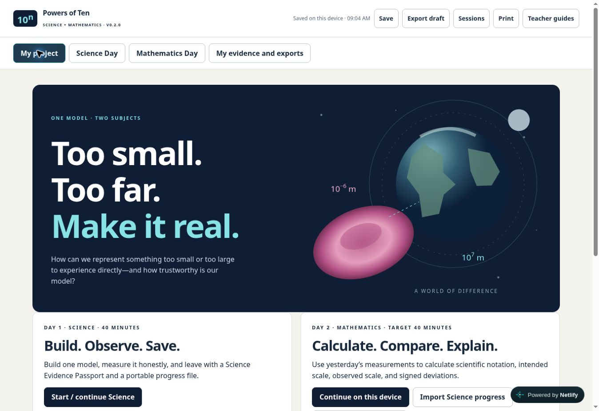

# Powers of Ten v0.2.0 Netlify deployment

Released 9 October 2026 UTC via PR #8, merged as `5fd279adbc4d0876ea72dab11c0cc226f0b92ebd`. Canonical repository: williammcada/Applied-Math-Projects. Netlify deploys main.

Public project: https://mcada-applied-math.netlify.app/powers-of-ten/

Verified HTTP 200 for the launcher, project, versioned standalone path and Mars Colony. Launcher displays v0.1.2 and Science + Math. The application and standalone source match the tested 164,000-byte candidate, SHA-256 `e26ba34d38febb95fb1af7c811675b0a7bddeb7d0d56bcb652106f6b7c34c7e0`.

Some Netlify responses are byte-identical; other clients receive an additional Netlify hosting comment and public HUD widget, producing 164,510 bytes and SHA-256 `137194b18784c52f6987af7b01646ffe2f4fd24f3a80df96fa6ad1f418fdda9f`. Removing only those two identified platform additions yields the exact candidate. No application changes were found. Netlify redirects the standalone .html path to its lowercase pretty URL in some clients.

Cloud Chrome visibly opened the v0.2.0 dashboard, Science Brief, Earth–Moon track, Mathematics Quantities and Scale audit. The local test Chromium could not navigate externally (`ERR_EMPTY_RESPONSE`); live UI verification therefore used Cloud Chrome. Full local workflows, file transfers and print results are in the QA report. Physical iPad, school network, printer calibration and a timed classroom trial remain unverified.

